# 🤖 GenAI & Agentic AI Learning Repository

<div align="center">


**A comprehensive learning repository documenting my journey through Generative AI and Agentic AI concepts**

</div>

---

## 📋 Table of Contents

- [Overview](#-overview)
- [Core Concepts Explained](#-core-concepts-explained)
- [Repository Structure](#-repository-structure)
- [Learning Progress](#-learning-progress)
- [Task-1: LangChain Chat Basics](#-task-1-langchain-chat-basics)
- [Task-2: Tool-Calling Agents](#-task-2-tool-calling-agents)
- [Task-3: Multi-Stage Pipeline (Legal Case Analysis)](#-task-3-multi-stage-pipeline-legal-case-analysis)
- [Task-4: LangGraph & Advanced Agentic AI](#-task-4-langgraph--advanced-agentic-ai)
- [Key Concepts Reference](#-key-concepts-reference)
- [How to Add New Tasks](#-how-to-add-new-tasks)
- [Setup & Installation](#-setup--installation)
- [Resources](#-resources)

---

## 🎯 Overview

This repository serves as my personal **learning logbook** for Generative AI (GenAI) and Agentic AI. It contains progressively complex implementations, starting from basic chatbots to sophisticated multi-agent systems with long-term memory.

### 🧠 Core Technologies Covered

| Technology | Description | Tasks Used In |
|------------|-------------|---------------|
| **LangChain** | Framework for LLM application development | Task 1, 2, 3, 4 |
| **LangGraph** | Framework for building agentic workflows | Task 4 |
| **Groq API** | High-speed LLM inference (Llama, Qwen models) | All Tasks |
| **Streamlit** | Web UI framework for ML applications | Task 1, 2, 3, 4 |
| **ChromaDB** | Vector database for embeddings | Task 4 |
| **Pydantic** | Data validation & structured outputs | All Tasks |

### 🗺️ Learning Journey Map

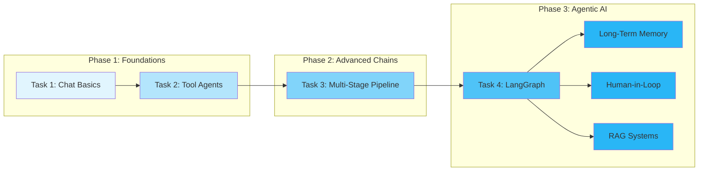

---

## 🧠 Core Concepts Explained

### What is LangChain?

**LangChain** is a framework that simplifies building applications with Large Language Models (LLMs). Think of it as a toolkit that provides:

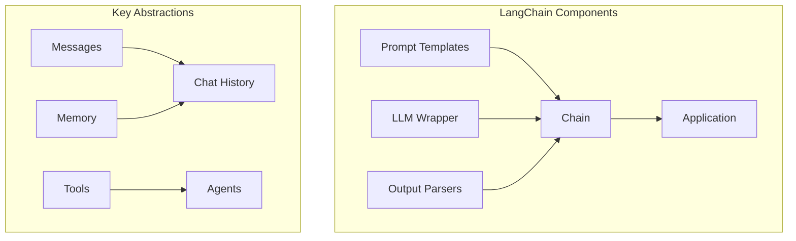

| Component | Purpose | Example |
|-----------|---------|---------|
| **Prompt Template** | Structured way to format prompts | `ChatPromptTemplate.from_messages([...])` |
| **LLM Wrapper** | Unified interface for different LLMs | `ChatGroq`, `ChatOpenAI` |
| **Chain** | Sequence of operations (prompt → LLM → parse) | `prompt \| llm \| parser` |
| **Memory** | Store conversation history | `MessagesPlaceholder` |
| **Tools** | External capabilities for agents | Search, Calculator, APIs |

### What is LangGraph?

**LangGraph** extends LangChain for building **stateful, multi-actor applications** with cycles. It's like a flowchart that can:
- Loop back (cycles)
- Make decisions (conditional edges)
- Remember state across steps (checkpointing)
- Pause for human input (interrupts)

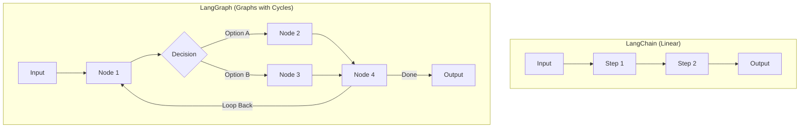

### What is RAG (Retrieval-Augmented Generation)?

RAG combines retrieval (searching documents) with generation (LLM responses) to ground answers in actual data:

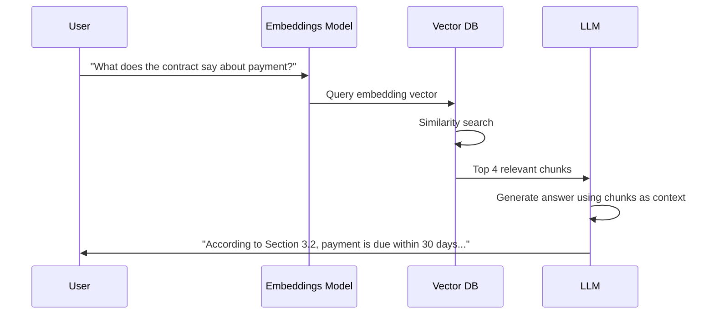

---

## 📁 Repository Structure

```
training/
├── README.md                    # This file - Learning logbook
├── .gitignore                   # Git ignore rules
├── task-1/                      # LangChain Chat Basics
│   ├── app.py                   # Streamlit chat interface
│   ├── chains.py                # LangChain chain composition
│   ├── llm.py                   # LLM configuration (Groq)
│   ├── prompt.py                # Prompt templates
│   └── requirements.txt
├── task-2/                      # Tool-Calling Agents
│   ├── main.py                  # Agentic assistant with tools
│   ├── tools.py                 # Tool definitions (search, calculator, etc.)
│   ├── schema.py                # Pydantic response schemas
│   └── requirements.txt
├── task-3/                      # Multi-Stage Legal Analysis Pipeline
│   ├── app.py                   # Main Streamlit application
│   ├── pipeline.py              # 5-stage analysis pipeline
│   ├── memory.py                # Session state management
│   ├── llm.py                   # LLM configuration
│   ├── config.py                # Application configuration
│   ├── schemas.py               # Pydantic schemas for all stages
│   ├── prompts/                 # Prompt templates per stage
│   │   ├── understand_case.txt
│   │   ├── extract_facts.txt
│   │   ├── identify_issues.txt
│   │   ├── generate_arguments.txt
│   │   └── predict_judgement.txt
│   ├── qna/                     # Q&A system with context builder
│   │   ├── context_builder.py
│   │   ├── qna_engine.py
│   │   ├── qna_memory.py
│   │   └── qna_prompts.txt
│   └── requirements.txt
├── task-4/                      # LangGraph Advanced Concepts
│   ├── app.py                   # RAG-enabled chatbot UI
│   ├── backend.py               # LangGraph state machine + tools
│   ├── hitl_example.py          # Human-in-the-Loop demo
│   ├── langgraph_essay.py       # Parallel evaluation workflow
│   ├── langgraph_chatbot.ipynb  # Basic LangGraph tutorial
│   ├── ltm_basics.ipynb         # Long-Term Memory basics
│   ├── ltm_advance.ipynb        # Advanced LTM patterns
│   ├── chroma_db/               # Persistent vector storage
│   ├── uploaded_documents/      # PDF storage for RAG
│   └── requirements.txt
└── .env                         # API keys (not tracked)
```

---

## 📊 Learning Progress

| Task | Topic | Complexity | Status |
|------|-------|------------|--------|
| Task 1 | LangChain Chat Basics | ⭐ Beginner | ✅ Complete |
| Task 2 | Tool-Calling Agents | ⭐⭐ Intermediate | ✅ Complete |
| Task 3 | Multi-Stage Pipelines | ⭐⭐⭐ Advanced | ✅ Complete |
| Task 4 | LangGraph & Long-Term Memory | ⭐⭐⭐⭐ Expert | ✅ Complete |
| Task 5 | *Future* | - | 🔜 Planned |

---

## 📘 Task-1: LangChain Chat Basics

### 🎯 Learning Objectives
- Understand LangChain fundamentals
- Build a basic chatbot with conversation history
- Learn prompt templating with `ChatPromptTemplate`
- Use `MessagesPlaceholder` for dynamic chat history

### 🏗️ Architecture

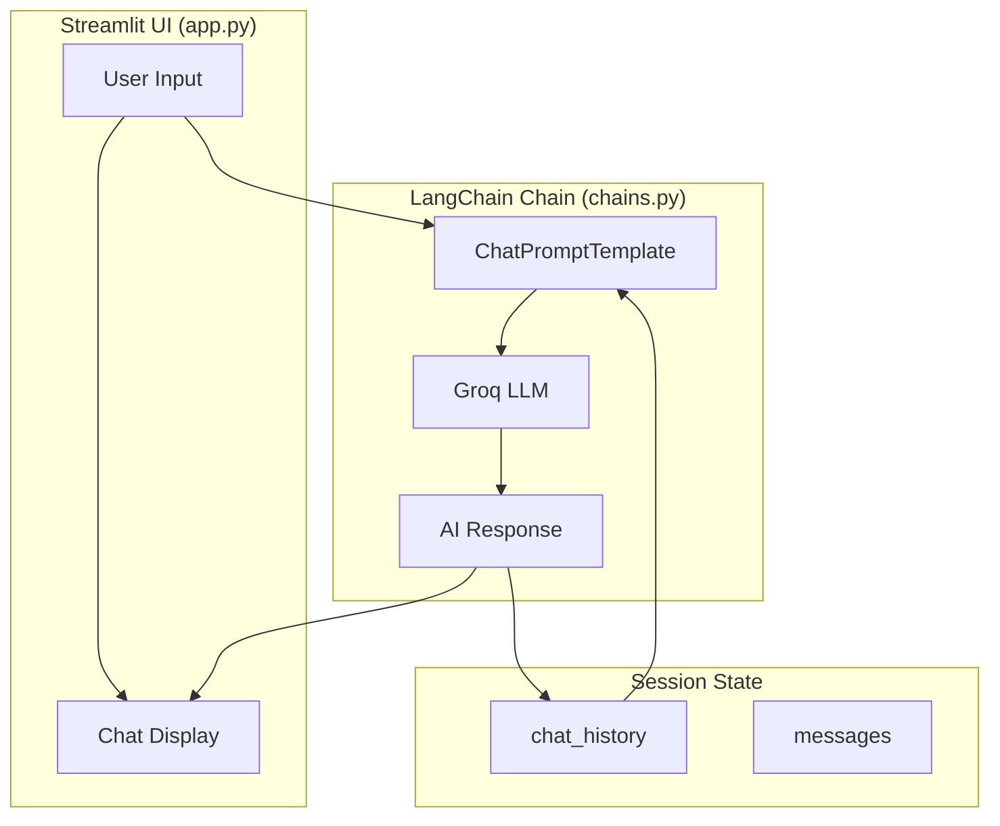

### 🧩 How It Works

#### The LCEL (LangChain Expression Language) Pipeline

LCEL uses the **pipe operator (`|`)** to chain components together. Data flows left to right:

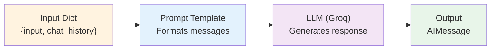

```python
# chains.py - The pipe operator creates a processing pipeline
chain = prompt | llm  # prompt output becomes llm input
```

#### Message Types in LangChain

| Message Type | Purpose | Created By |
|--------------|---------|------------|
| `SystemMessage` | Sets assistant behavior | Developer |
| `HumanMessage` | User's input | User |
| `AIMessage` | LLM's response | LLM |
| `ToolMessage` | Tool execution results | Tools |

#### Code Walkthrough

**`llm.py`** - LLM Configuration:
```python
from langchain_groq import ChatGroq

llm = ChatGroq(
    model="qwen/qwen3-32b",    # Model to use
    temperature=0.1,            # Lower = more deterministic
    max_tokens=None,            # No limit
    max_retries=2,              # Retry on failure
)
```

**`prompt.py`** - Prompt Template:
```python
def create_prompt():
    return ChatPromptTemplate.from_messages([
        ("system", "You are a helpful assistant..."),  # Fixed instruction
        MessagesPlaceholder(variable_name="chat_history"),  # Dynamic history
        ("human", "{input}")  # Current user message
    ])
```

**`app.py`** - Streamlit Integration:
```python
# Invoke the chain with both current input and history
response = st.session_state.chain.invoke({
    "input": user_input,
    "chat_history": st.session_state.chat_history
})

# Update history for next turn
st.session_state.chat_history.append(HumanMessage(content=user_input))
st.session_state.chat_history.append(AIMessage(content=bot_reply))
```

### 📊 Chat History Flow Diagram

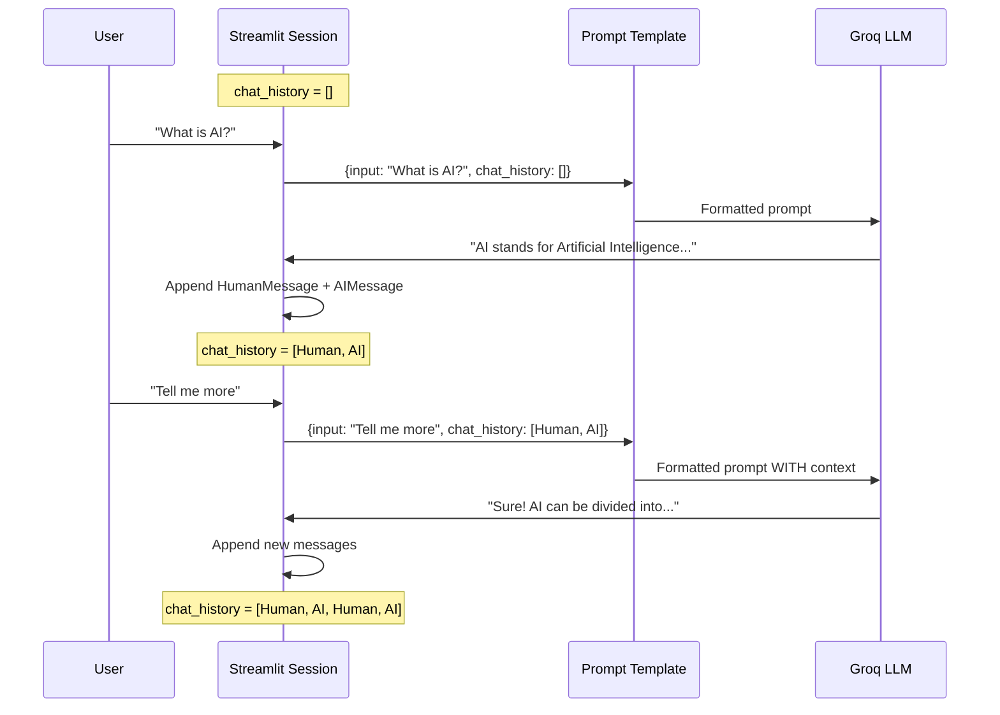

### 🔧 Technologies Used
- **LangChain Core**: `ChatPromptTemplate`, `MessagesPlaceholder`
- **LangChain Groq**: `ChatGroq` for LLM inference
- **Model**: `qwen/qwen3-32b` (via Groq)
- **UI**: Streamlit

---

## 🛠️ Task-2: Tool-Calling Agents

### 🎯 Learning Objectives
- Understand the **ReAct (Reasoning + Acting)** pattern
- Build an agent that can use external tools
- Learn tool definition with schemas
- Implement structured output parsing
- Handle agent iterations and error recovery

### 🏗️ Architecture

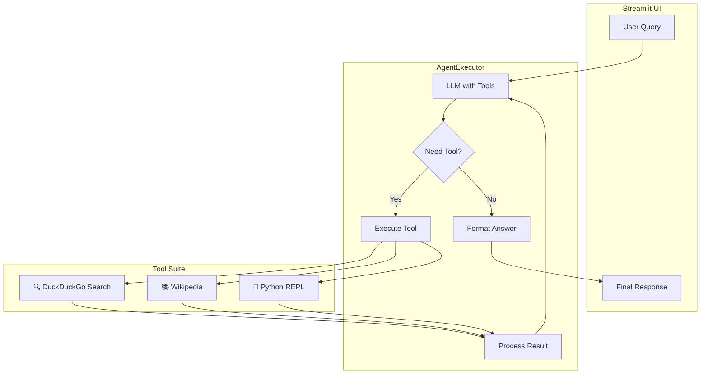

### 🧠 Understanding the ReAct Pattern

**ReAct** stands for **Re**asoning + **Act**ing. It's a prompting strategy where the LLM:

1. **Thinks** about what to do (Reasoning)
2. **Acts** by calling a tool (Acting)
3. **Observes** the tool's output
4. **Repeats** until it can answer

```mermaid
stateDiagram-v2
    [*] --> Thought: User Query
    Thought --> Action: Decide tool needed
    Action --> Observation: Execute tool
    Observation --> Thought: Process result
    Thought --> FinalAnswer: Have enough info
    FinalAnswer --> [*]
    
    note right of Thought: "I need to calculate 2^100"
    note right of Action: "python_interpreter"
    note right of Observation: "Result: 1.27e30"
```

### 📝 Code Deep Dive

#### Tool Definition in `tools.py`

Tools are functions that the LLM can call. Each tool has:
- **Name**: Identifier the LLM uses
- **Description**: Helps LLM decide when to use it
- **Schema**: Validates inputs (Pydantic)
- **Function**: The actual code to execute

```python
# Simple Tool - just function + description
tools = [
    Tool(
        name="duckduckgo_search",
        func=DuckDuckGoSearchRun().run,
        description="Search the live web for current events, news, and real-time data."
    ),
]

# Structured Tool - with input validation
class PythonInterpreterInput(BaseModel):
    """Input schema for python interpreter tool."""
    code: str = Field(description="The Python code to execute.")

StructuredTool(
    name="python_interpreter",
    func=python_interpreter_wrapper,
    description="Execute python code for complex math or logic.",
    args_schema=PythonInterpreterInput  # Pydantic validation
)
```

#### Agent Executor Configuration in `main.py`

```python
# Create the agent (LLM + Tools + Prompt)
agent = create_tool_calling_agent(llm, tools, prompt)

# AgentExecutor runs the ReAct loop
agent_executor = AgentExecutor(
    agent=agent, 
    tools=tools, 
    verbose=True,              # Show reasoning steps
    max_iterations=15,         # Prevent infinite loops
    early_stopping_method="force",  # Stop safely if stuck
    handle_parsing_errors=True,     # Recover from malformed outputs
    return_intermediate_steps=True  # Access tool calls for debugging
)
```

#### Structured Output with `schema.py`

```python
class AssistantResponse(BaseModel):
    """Ensures consistent, validated output structure."""
    reasoning: str = Field(description="Step-by-step logic used")
    answer: str = Field(description="The final concise answer")
    tools_used: List[str] = Field(description="List of tools accessed")
    confidence: float = Field(description="Confidence score 0-1")
```

### 📊 ReAct Execution Flow

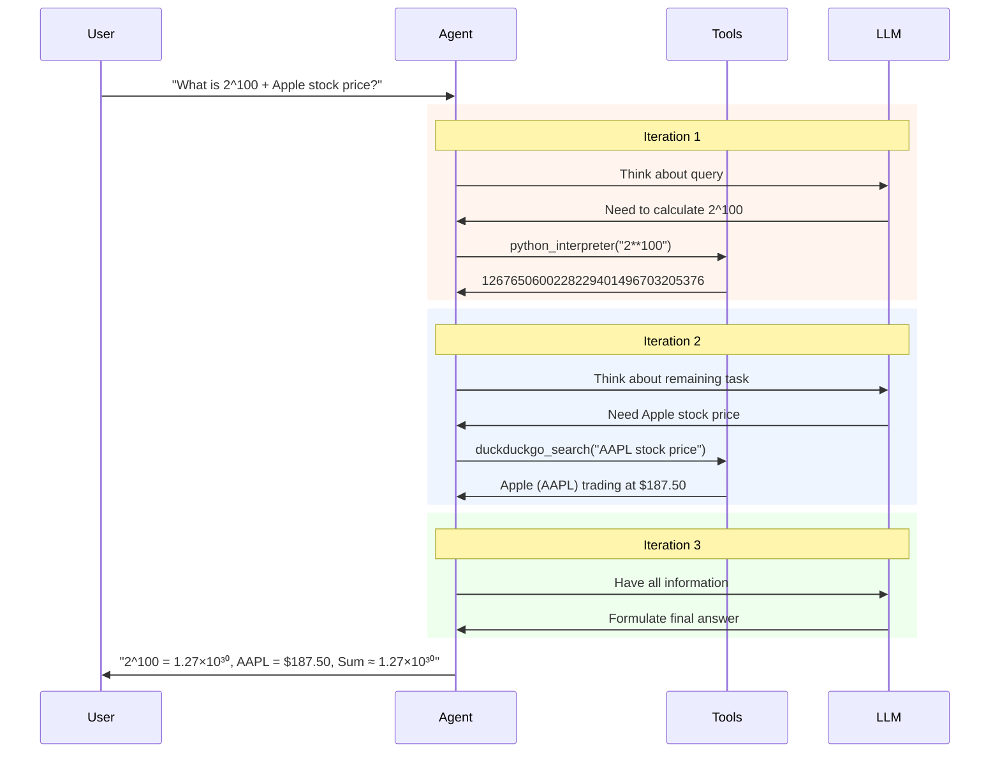

### 🔧 Technologies Used
- **LangChain Classic**: `AgentExecutor`, `create_tool_calling_agent`
- **Tools**: DuckDuckGoSearch, WikipediaQuery, PythonREPL
- **Model**: `llama-3.3-70b-versatile` (via Groq)
- **Callbacks**: `StreamlitCallbackHandler` for real-time UI updates

---

## ⚖️ Task-3: Multi-Stage Pipeline (Legal Case Analysis)

### 🎯 Learning Objectives
- Build a **multi-stage LLM pipeline** where outputs flow between stages
- Implement **structured JSON output** with repair mechanisms
- Create a **context-aware Q&A system** over analysis results
- Learn memory management for both pipeline state and conversations
- Design **modular prompt engineering** with external template files

### 🏗️ Architecture

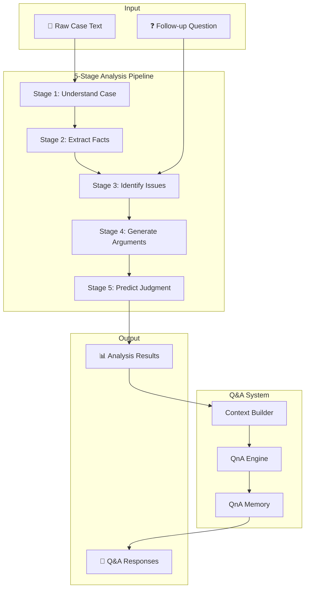

### 🧠 Understanding the Multi-Stage Pipeline

Each stage in the pipeline has a specific role and passes structured data to the next stage:

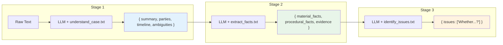

### 📊 Pipeline Stage Details

| Stage | Input | Output Schema | Prompt File | Purpose |
|-------|-------|---------------|-------------|---------|
| **1. Understand Case** | Raw case text | `CaseUnderstanding` | `understand_case.txt` | Paraphrase without legal conclusions |
| **2. Extract Facts** | Understanding | `ExtractedFacts` | `extract_facts.txt` | Separate facts from interpretation |
| **3. Identify Issues** | Facts + Follow-up | `LegalIssues` | `identify_issues.txt` | Spot legal issues as questions |
| **4. Generate Arguments** | Facts + Issues | `ArgumentsByIssue` | `generate_arguments.txt` | Balanced argument generation |
| **5. Predict Judgment** | Facts + Issues + Args | `JudgmentPrediction` | `predict_judgement.txt` | Cautious prediction with assumptions |

### 📝 Code Deep Dive

#### Pipeline Execution Flow (`pipeline.py`)

```python
def run_llm(prompt_text: str, variables: Dict, max_tokens: int = None) -> Dict:
    """Core function that runs each pipeline stage."""
    llm = get_llm(max_tokens=max_tokens)
    
    prompt = ChatPromptTemplate.from_messages([
        ("system", prompt_text),  # Loaded from .txt file
        ("human", "{input}")      # Variables as JSON
    ])
    
    chain = prompt | llm | StrOutputParser()
    
    raw_output = chain.invoke({"input": json.dumps(variables)})
    
    # Extract and repair JSON from LLM output
    json_text = extract_json_from_text(raw_output)
    json_text = repair_json(json_text)  # Fix common LLM JSON errors
    
    return json.loads(json_text)
```

#### JSON Repair Mechanism

LLMs sometimes produce malformed JSON. The repair function fixes common issues:

```python
def repair_json(json_text: str) -> str:
    """Fix common LLM JSON issues."""
    # Fix: Missing comma after ] or } before "
    # Example: ]["key"  →  ], "key"
    json_text = re.sub(r'([\]}])\s*\n\s*(")', r'\1,\n\2', json_text)
    
    # Fix: Trailing comma before closing bracket
    # Example: ["item",]  →  ["item"]
    json_text = re.sub(r',(\s*[}\]])', r'\1', json_text)
    
    return json_text
```

#### Pydantic Schemas (`schemas.py`)

```python
class CaseUnderstanding(BaseModel):
    summary: str = Field(..., description="Plain-language summary")
    parties: List[str] = Field(..., description="Parties involved")
    timeline: List[str] = Field(..., description="Chronological events")
    ambiguities: List[str] = Field(..., description="Unclear facts")

class ArgumentSide(BaseModel):
    points: List[str] = Field(..., description="Key arguments")
    relied_facts: List[str] = Field(..., description="Facts relied upon")

class IssueArguments(BaseModel):
    side_a: ArgumentSide  # Plaintiff/Prosecution
    side_b: ArgumentSide  # Defendant
    strength: Literal["weak", "moderate", "strong"]
```

#### Context-Aware Q&A (`qna/context_builder.py`)

The Q&A system only includes relevant context based on keywords in the question:

```python
# Keyword buckets for intelligent context selection
ARGUMENT_KEYWORDS = {"argument", "claim", "defense", "plaintiff", "defendant"}
JUDGMENT_KEYWORDS = {"judgment", "outcome", "result", "win", "lose"}

def build_context(question: str, analysis_memory: Dict) -> Dict:
    """Build minimal, relevant context based on question."""
    question_lower = question.lower()
    context = {}
    
    # Only include arguments if question is about arguments
    if any(word in question_lower for word in ARGUMENT_KEYWORDS):
        context["arguments"] = analysis_memory.get("arguments")
    
    # Only include judgment if question is about outcome
    if any(word in question_lower for word in JUDGMENT_KEYWORDS):
        context["judgment"] = analysis_memory.get("judgment")
    
    return context  # Smaller context = better answers + lower cost
```

### 📊 Data Flow Through Pipeline

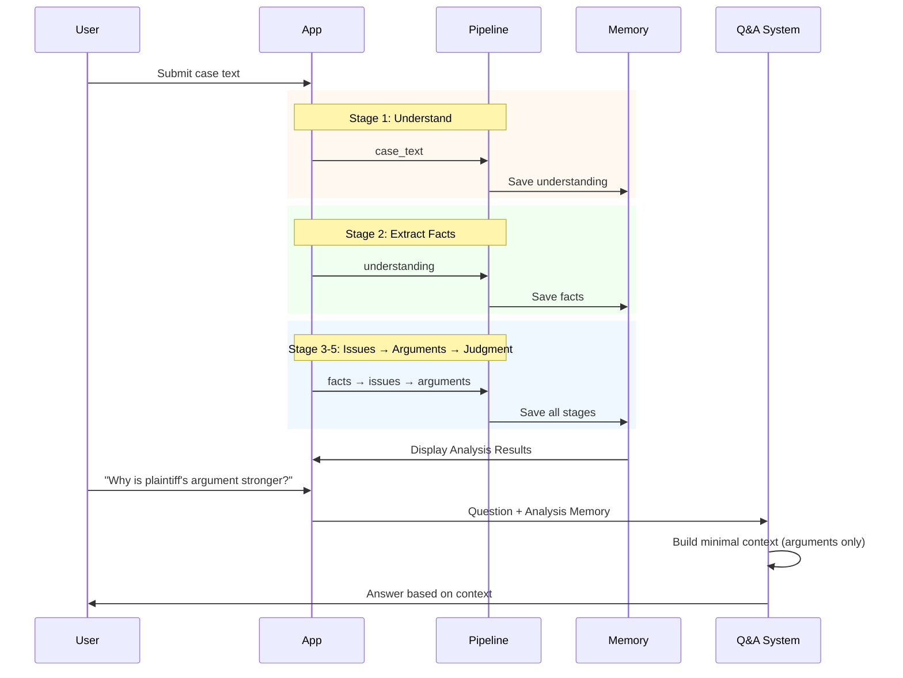

### 🔧 Technologies Used
- **Prompt Management**: External `.txt` template files for easy editing
- **JSON Repair**: Custom regex-based repair utilities
- **Memory**: Streamlit session state for pipeline stages + Q&A history
- **Model**: `moonshotai/kimi-k2-instruct-0905` (via Groq)

---

## 🔄 Task-4: LangGraph & Advanced Agentic AI

### 🎯 Learning Objectives
- Master **LangGraph** for stateful, multi-node agentic workflows
- Implement **checkpointing** for conversation persistence
- Build **Human-in-the-Loop (HITL)** systems with `interrupt()`
- Create **RAG pipelines** with ChromaDB vector storage
- Understand **Long-Term Memory (LTM)** patterns with InMemoryStore
- Learn **parallel node execution** for fan-out workflows

### 📁 Task-4 Components Overview

| File | Purpose | Key Concepts |
|------|---------|--------------|
| `langgraph_chatbot.ipynb` | Basic LangGraph intro | StateGraph, MemorySaver, checkpointing |
| `ltm_basics.ipynb` | Long-Term Memory fundamentals | InMemoryStore, namespaces, semantic search |
| `ltm_advance.ipynb` | Advanced LTM patterns | Memory extraction, deduplication, merged workflow |
| `langgraph_essay.py` | Parallel evaluation workflow | Fan-out pattern, score aggregation |
| `hitl_example.py` | Human-in-the-Loop demo | `interrupt()`, `Command(resume=...)` |
| `app.py` + `backend.py` | Full RAG chatbot | PDF ingestion, tool selection, async checkpointing |

---

### 📘 4.1 LangGraph Basics (`langgraph_chatbot.ipynb`)

#### What is a StateGraph?

A **StateGraph** is a directed graph where:
- **Nodes** = Functions that transform state
- **Edges** = Control flow between nodes
- **State** = Shared data structure (like a TypedDict)

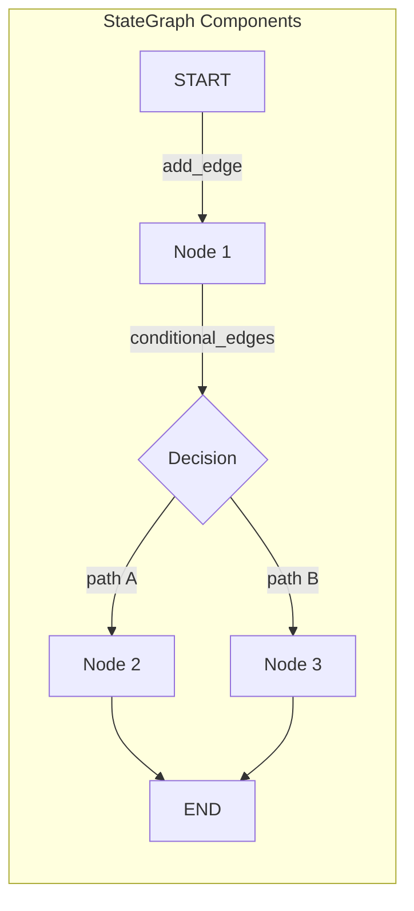

#### Core Concepts Explained

**1. State Definition with `add_messages`:**
```python
from typing import TypedDict, Annotated
from langgraph.graph.message import add_messages

class ChatState(TypedDict):
    # Annotated with add_messages = messages accumulate, not replace
    messages: Annotated[list[BaseMessage], add_messages]
```

The `add_messages` reducer means each node's output gets **appended** to the list, not replaced.

**2. Graph Construction:**
```python
from langgraph.graph import StateGraph, START, END

graph = StateGraph(ChatState)
graph.add_node('chat_node', chat_node)  # Register node
graph.add_edge(START, 'chat_node')       # START → chat_node
graph.add_edge('chat_node', END)         # chat_node → END
```

**3. Checkpointing (Memory Persistence):**
```python
from langgraph.checkpoint.memory import MemorySaver

checkpointer = MemorySaver()  # In-memory (for dev)
# Or: AsyncSqliteSaver for production

chatbot = graph.compile(checkpointer=checkpointer)

# Each thread_id maintains separate conversation history
result = chatbot.invoke(
    {"messages": [HumanMessage(content="Hi")]},
    config={"configurable": {"thread_id": "user-123"}}
)
```

#### Architecture Diagram

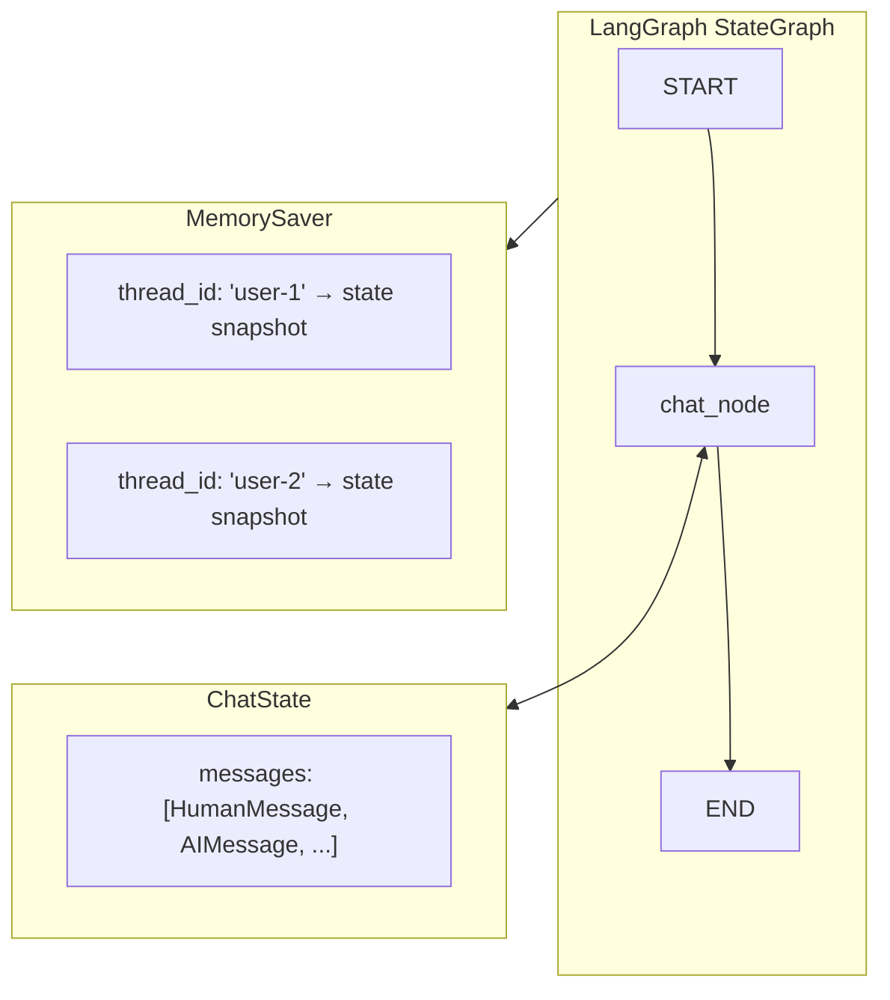

---

### 📗 4.2 Long-Term Memory Basics (`ltm_basics.ipynb`)

#### What is InMemoryStore?

**InMemoryStore** is LangGraph's key-value store for persisting user data across sessions. Think of it as a database organized by **namespaces** (like folders).

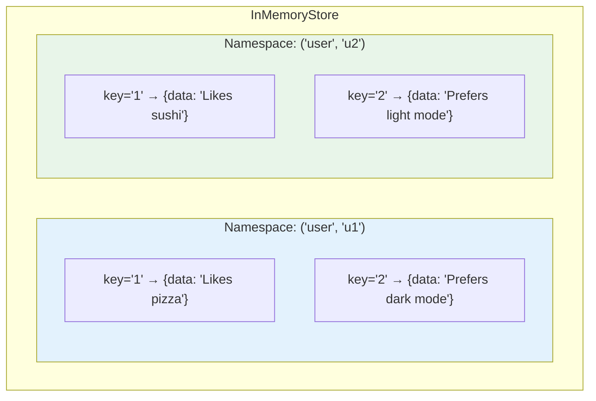

#### CRUD Operations

```python
from langgraph.store.memory import InMemoryStore

store = InMemoryStore()

# CREATE: store.put(namespace, key, value)
namespace = ("user", "u1")
store.put(namespace, "1", {"data": "User likes pizza"})
store.put(namespace, "2", {"data": "User prefers dark mode"})

# READ: store.get(namespace, key)
item = store.get(namespace, "1")  # Returns SearchItem

# SEARCH: store.search(namespace, query=..., limit=...)
items = store.search(namespace)  # Get all in namespace
items = store.search(namespace, query="preferences", limit=3)  # Semantic search

# DELETE: store.delete(namespace, key)
store.delete(namespace, "1")
```

#### Semantic Search with Embeddings

When you create the store with an embedding model, `search()` becomes semantic:

```python
from langchain_ollama import OllamaEmbeddings

embeddings = OllamaEmbeddings(model="nomic-embed-text")
store = InMemoryStore(index={'embed': embeddings, 'dims': 1536})

# Now search finds semantically similar items
items = store.search(namespace, query="what does user like to eat", limit=1)
# Returns: {"data": "User likes pizza"} (even though "pizza" ≠ "eat")
```

---

### 📙 4.3 Advanced Long-Term Memory (`ltm_advance.ipynb`)

#### Three LTM Patterns

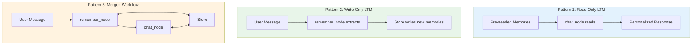

#### Memory Extraction with Deduplication

The key challenge: **How to avoid storing duplicate memories?**

Solution: Use LLM to compare new info against existing memories:

```python
class MemoryItem(BaseModel):
    text: str = Field(description="Atomic user memory")
    is_new: bool = Field(description="True if NEW, false if duplicate")

class MemoryDecision(BaseModel):
    should_write: bool
    memories: List[MemoryItem]

MEMORY_PROMPT = """
CURRENT USER DETAILS (existing memories):
{user_details_content}

TASK:
- Extract user-specific info from the message
- For each item, set is_new=true ONLY if it adds NEW information
- If same meaning as existing memory, set is_new=false
"""

# Only store truly new memories
if decision.should_write:
    for mem in decision.memories:
        if mem.is_new:  # Skip duplicates
            store.put(namespace, str(uuid.uuid4()), {"data": mem.text})
```

#### Merged Workflow: Read + Write

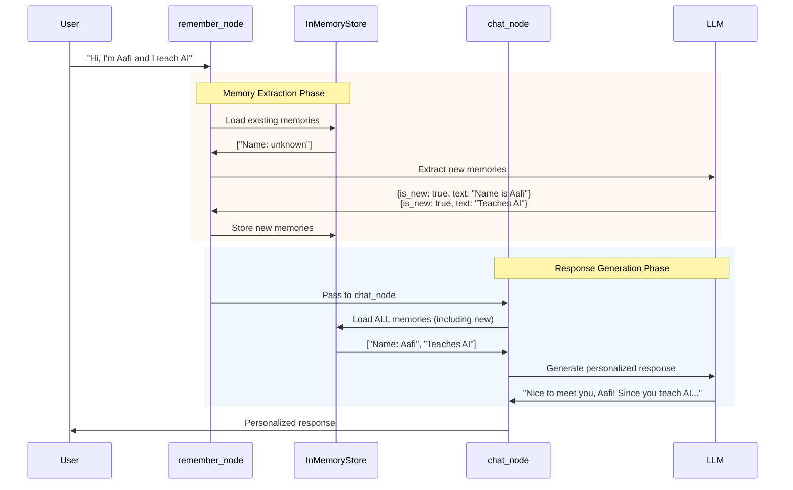

---

### 📕 4.4 Parallel Evaluation Workflow (`langgraph_essay.py`)

#### Fan-Out/Fan-In Pattern

When multiple nodes have the same source, they execute **in parallel**:

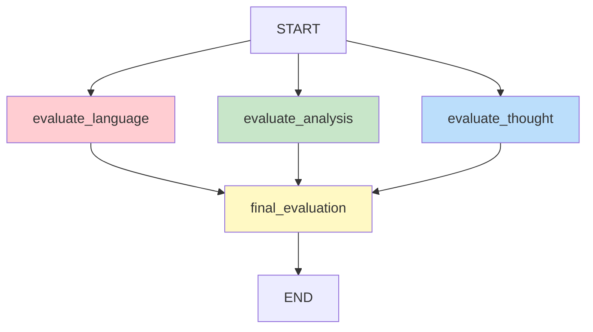

#### State with Score Aggregation

```python
from typing import Annotated
import operator

class UPSCState(TypedDict):
    essay: str
    language_feedback: str
    analysis_feedback: str
    clarity_feedback: str
    overall_feedback: str
    # operator.add = merge lists from parallel nodes
    individual_scores: Annotated[List[int], operator.add]
    avg_score: float
```

The `operator.add` reducer automatically combines scores from parallel nodes:

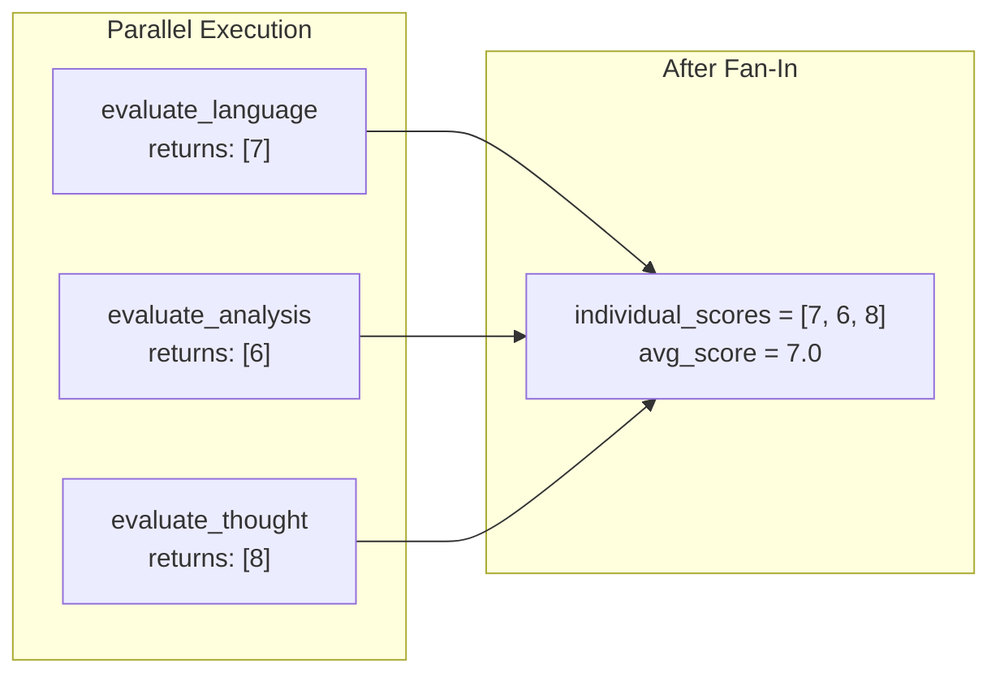

---

### 📘 4.5 Human-in-the-Loop (`hitl_example.py`)

#### The `interrupt()` Function

**interrupt()** pauses graph execution and returns control to the caller (human). The graph state is saved, waiting for human input.

```mermaid
sequenceDiagram
    participant U as User
    participant G as Graph
    participant T as Tool
    participant H as Human
    
    U->>G: "Buy 10 AAPL shares"
    G->>T: Call purchase_stock
    T->>T: interrupt("Approve?")
    T-->>G: Graph PAUSED
    G-->>H: "Approve buying 10 shares?"
    
    Note over G,H: ⏸️ Execution Paused
    
    H->>G: Command(resume="yes")
    G->>T: Resume with "yes"
    T->>T: Process approval
    T->>G: "Purchase successful"
    G->>U: "Bought 10 AAPL shares"
```

#### Code Implementation

```python
from langgraph.types import interrupt, Command

@tool
def purchase_stock(symbol: str, quantity: int) -> str:
    """Purchase stock - requires human approval."""
    # PAUSE execution here
    decision = interrupt(f"Approve buying {quantity} shares of {symbol}? (yes/no)")
    
    # This code runs AFTER human responds
    if decision.lower() == "yes":
        return f"SUCCESS: Purchased {quantity} shares of {symbol}"
    else:
        return f"CANCELLED: Purchase declined by human"

# In the main loop:
result = chatbot.invoke(state, config)

# Check if graph is waiting for human
if result.get("__interrupt__"):
    prompt = result["__interrupt__"][0].value
    human_decision = input(f"HITL: {prompt}")
    
    # Resume execution with human's decision
    result = chatbot.invoke(
        Command(resume=human_decision),
        config
    )
```

---

### 📗 4.6 Full RAG Chatbot (`app.py` + `backend.py`)

#### Complete System Architecture

```mermaid
flowchart TB
    subgraph UI["Streamlit UI (app.py)"]
        A[Chat Interface]
        B[PDF Upload]
        C[Session Selector]
    end
    
    subgraph Backend["Backend (backend.py)"]
        subgraph Graph["LangGraph State Machine"]
            D[START] --> E[chat_node]
            E --> F{tools_condition}
            F -->|needs tool| G[tools_node]
            G --> E
            F -->|done| H[END]
        end
        
        subgraph Tools["Tool Suite"]
            I[🔍 web_search]
            J[🧮 calculator]
            K[📈 get_stock]
            L[📄 document_search]
        end
    end
    
    subgraph Storage["Persistent Storage"]
        M[(ChromaDB<br/>Vector Store)]
        N[(SQLite<br/>Checkpoints)]
        O[PDF Files]
    end
    
    A --> E
    G --> I & J & K & L
    L <--> M
    E <--> N
    B --> O --> M
```

#### PDF Ingestion Pipeline

```mermaid
flowchart LR
    subgraph Input
        A[PDF Upload]
    end
    
    subgraph Processing
        B[PDFPlumberLoader] --> C[RecursiveTextSplitter]
        C --> D[1000 char chunks<br/>200 overlap]
    end
    
    subgraph Embedding
        D --> E[Ollama Embeddings<br/>nomic-embed-text]
        E --> F[Vector representations]
    end
    
    subgraph Storage
        F --> G[(ChromaDB<br/>Persistent Collection)]
    end
    
    A --> B
```

#### Document Deduplication System

```mermaid
flowchart TB
    A[PDF Uploaded] --> B[Compute SHA256 Hash]
    B --> C{Hash in<br/>document_hashes.json?}
    
    C -->|Yes: CACHE HIT| D[Load existing collection]
    D --> E["⚡ Instant (no re-embedding)"]
    
    C -->|No: CACHE MISS| F[Process PDF]
    F --> G[Chunk text]
    G --> H[Generate embeddings]
    H --> I[Store in ChromaDB]
    I --> J[Save hash mapping]
    
    E --> K[Create Retriever]
    J --> K
```

#### Tool Selection Logic

The LLM automatically selects the right tool based on the query:

```mermaid
flowchart TB
    Q[User Query] --> A{Contains 'document'<br/>'PDF', 'uploaded'?}
    A -->|Yes| T1[📄 document_search]
    A -->|No| B{Contains math<br/>or 'calculate'?}
    B -->|Yes| T2[🧮 calculator]
    B -->|No| C{Contains 'stock'<br/>'price', ticker?}
    C -->|Yes| T3[📈 get_stock_price]
    C -->|No| T4[🔍 web_search]
```

### 🔧 Technologies Used (Task-4)
- **LangGraph**: StateGraph, MemorySaver, AsyncSqliteSaver, InMemoryStore
- **Vector DB**: ChromaDB (persistent), Ollama embeddings (nomic-embed-text)
- **PDF Processing**: PDFPlumber, RecursiveCharacterTextSplitter
- **Tools**: DuckDuckGo, Calculator, Stock API (Alpha Vantage), Document Search
- **Model**: `llama-3.1-8b-instant` (via Groq)
- **Async**: aiosqlite, httpx for non-blocking operations

---

## 📚 Key Concepts Reference

### LangChain vs LangGraph Comparison

```mermaid
graph LR
    subgraph LangChain["🔗 LangChain"]
        A1[Prompt] --> B1[LLM]
        B1 --> C1[Output Parser]
        C1 --> D1[Response]
    end
    
    subgraph LangGraph["📊 LangGraph"]
        A2[START] --> B2[Node A]
        B2 --> C2{Conditional}
        C2 -->|Path 1| D2[Node B]
        C2 -->|Path 2| E2[Node C]
        D2 --> F2[END]
        E2 --> F2
    end
    
    style LangChain fill:#e3f2fd
    style LangGraph fill:#e8f5e9
```

| Aspect | LangChain | LangGraph |
|--------|-----------|-----------|
| **Primary Use** | Linear chains & simple agents | Complex stateful workflows |
| **State Management** | Manual (session state) | Built-in StateGraph with reducers |
| **Checkpointing** | External implementation | Native MemorySaver/SqliteSaver |
| **Branching** | Limited (RunnableBranch) | Full graph control with conditionals |
| **Human-in-Loop** | Manual interrupts | Native `interrupt()` function |
| **Long-Term Memory** | External stores required | Built-in InMemoryStore |
| **Parallelism** | Via RunnableParallel | Native fan-out from same node |

### Memory Types Overview

```mermaid
graph TB
    subgraph MemTypes["Memory Types in Agentic AI"]
        subgraph STM["Short-Term Memory"]
            A["Chat History<br/>(MessagesPlaceholder)"]
            B["Session State<br/>(st.session_state)"]
        end
        
        subgraph MTM["Medium-Term Memory"]
            C["Thread Checkpoints<br/>(MemorySaver/SQLite)"]
        end
        
        subgraph LTM["Long-Term Memory"]
            D["User Profile<br/>(InMemoryStore)"]
            E["Knowledge Base<br/>(ChromaDB/RAG)"]
        end
    end
    
    style STM fill:#ffcdd2
    style MTM fill:#fff9c4
    style LTM fill:#c8e6c9
```

| Type | Scope | Persistence | Implementation | Use Case |
|------|-------|-------------|----------------|----------|
| **Chat History** | Single turn | In-memory | `MessagesPlaceholder` | Context window |
| **Session State** | Browser tab | Tab lifetime | `st.session_state` | UI state |
| **Thread Memory** | Conversation | SQLite | `AsyncSqliteSaver` | Multi-turn dialogs |
| **User Profile** | Per user | InMemoryStore | Namespace-based | Preferences/profile |
| **RAG Memory** | Per document | ChromaDB | Vector embeddings | Document knowledge |

### Tool Selection Decision Tree

```mermaid
flowchart TD
    Q["🗣️ User Query"] --> A{{"Contains 'document',<br/>'PDF', 'uploaded'?"}}
    
    A -->|✅ Yes| T1["📄 document_search<br/>ChromaDB retrieval"]
    A -->|❌ No| B{{"Contains math<br/>or 'calculate'?"}}
    
    B -->|✅ Yes| T2["🧮 calculator<br/>Safe eval()"]
    B -->|❌ No| C{{"Contains 'stock',<br/>'price', ticker?"}}
    
    C -->|✅ Yes| T3["📈 get_stock_price<br/>Alpha Vantage API"]
    C -->|❌ No| D{{"Needs current<br/>info/facts?"}}
    
    D -->|✅ Yes| T4["🔍 web_search<br/>DuckDuckGo"]
    D -->|❌ No| T5["💬 Direct Response<br/>LLM knowledge only"]
    
    style T1 fill:#e8f5e9
    style T2 fill:#fff3e0
    style T3 fill:#e3f2fd
    style T4 fill:#fce4ec
    style T5 fill:#f3e5f5
```

### Reducer Functions Explained

LangGraph uses **reducers** to merge state updates from multiple nodes:

```mermaid
graph LR
    subgraph Reducers["Common Reducer Functions"]
        A["add_messages<br/>(append to list)"]
        B["operator.add<br/>(concatenate lists)"]
        C["default<br/>(last write wins)"]
    end
    
    subgraph Example["Example: Parallel Scores"]
        E1["Node 1: [7]"] --> M["Merged: [7, 8, 6]"]
        E2["Node 2: [8]"] --> M
        E3["Node 3: [6]"] --> M
    end
```

```python
class State(TypedDict):
    # add_messages: Each node's messages get APPENDED
    messages: Annotated[list, add_messages]
    
    # operator.add: Lists from parallel nodes get CONCATENATED
    scores: Annotated[List[int], operator.add]
    
    # No reducer: Last write OVERWRITES
    final_answer: str
```

### RAG Pipeline Anatomy

```mermaid
flowchart LR
    subgraph Ingestion["📥 Ingestion Phase"]
        A[PDF] --> B[Loader]
        B --> C[Splitter]
        C --> D[Chunks]
        D --> E[Embedder]
        E --> F[(Vector DB)]
    end
    
    subgraph Query["🔍 Query Phase"]
        G[Question] --> H[Embed Query]
        H --> I[Similarity Search]
        F --> I
        I --> J[Top-K Chunks]
        J --> K[Prompt + Context]
        K --> L[LLM]
        L --> M[Answer]
    end
    
    style Ingestion fill:#e3f2fd
    style Query fill:#e8f5e9
```

---

## 📝 How to Add New Tasks

### Template for New Task Documentation

```markdown
## 📘 Task-N: [Task Title]

### 🎯 Learning Objectives
- Objective 1
- Objective 2

### 🏗️ Architecture
[Mermaid diagram of system architecture]

### 📝 Key Code Patterns
[Code snippets with explanations]

### 📊 Data Flow / Concept Diagram
[Mermaid diagram of flow]

### 🔧 Technologies Used
- List of technologies and their roles
```

### Steps to Add a New Task

```mermaid
flowchart LR
    A["1️⃣ Create<br/>task-N/"] --> B["2️⃣ Add<br/>requirements.txt"]
    B --> C["3️⃣ Implement<br/>Code"]
    C --> D["4️⃣ Update<br/>README.md"]
    
    style A fill:#e3f2fd
    style B fill:#e8f5e9
    style C fill:#fff3e0
    style D fill:#fce4ec
```

1. **Create folder**: `task-N/`
2. **Add requirements.txt**: List all dependencies
3. **Implement code**: Follow existing patterns
4. **Update this README**:
   - Add to "Repository Structure"
   - Add to "Learning Progress" table
   - Create full documentation section
   - Update "Key Concepts Reference" if new concepts

---

## 🚀 Setup & Installation

### Prerequisites
- Python 3.10+
- Ollama (for local embeddings in Task-4)
- Groq API key

### Environment Setup

```bash
# Clone repository
git clone <repo-url>
cd training

# Create virtual environment
python -m venv venv
source venv/bin/activate  # or `venv\Scripts\activate` on Windows

# Install dependencies for specific task
pip install -r task-N/requirements.txt

# Create .env file
echo "GROQ_API_KEY=your-key-here" > .env
```

### Running Applications

```bash
# Task 1, 2, 3, 4 (Streamlit apps)
streamlit run task-N/app.py

# Task 4 - HITL example (CLI)
python task-4/hitl_example.py

# Task 4 - Essay evaluator
python task-4/langgraph_essay.py
```

### Ollama Setup (for Task-4 embeddings)

```bash
# Install Ollama
# Download from https://ollama.ai

# Pull embedding model
ollama pull nomic-embed-text

# Verify running
curl http://127.0.0.1:11434/api/tags
```

---

## 📖 Resources

### Official Documentation
- [LangChain Docs](https://python.langchain.com/docs/)
- [LangGraph Docs](https://langchain-ai.github.io/langgraph/)
- [Groq API](https://console.groq.com/docs)
- [ChromaDB](https://docs.trychroma.com/)
- [Streamlit](https://docs.streamlit.io/)

### Recommended Learning Path

```mermaid
flowchart LR
    A["1. LCEL<br/>Basics"] --> B["2. Prompt<br/>Engineering"]
    B --> C["3. Agents<br/>(ReAct)"]
    C --> D["4. LangGraph<br/>State Machines"]
    D --> E["5. Memory<br/>Patterns"]
    E --> F["6. HITL<br/>Systems"]
    F --> G["7. Production<br/>Deployment"]
    
    style A fill:#e3f2fd
    style B fill:#e8f5e9
    style C fill:#fff3e0
    style D fill:#fce4ec
    style E fill:#f3e5f5
    style F fill:#e0f2f1
    style G fill:#fff8e1
```

1. **LangChain Expression Language (LCEL) basics**
2. **Prompt engineering patterns**
3. **Agent architectures (ReAct, Tool-Calling)**
4. **LangGraph state machines**
5. **Memory patterns (Short-term, Long-term, RAG)**
6. **Human-in-the-Loop systems**
7. **Production deployment patterns**

---

<div align="center">

**Last Updated**: January 2025

Made with ❤️ for learning GenAI & Agentic AI

</div>
