# 🤖 GenAI & Agentic AI Learning Repository

<div align="center">


**A comprehensive learning repository documenting my journey through Generative AI and Agentic AI concepts**

</div>

---

## 📋 Table of Contents

- [Overview](#-overview)
- [Core Concepts Explained](#-core-concepts-explained)
- [Repository Structure](#-repository-structure)
- [Learning Progress](#-learning-progress)
- [Task-1: LangChain Chat Basics](#-task-1-langchain-chat-basics)
- [Task-2: Tool-Calling Agents](#-task-2-tool-calling-agents)
- [Task-3: Multi-Stage Pipeline (Legal Case Analysis)](#-task-3-multi-stage-pipeline-legal-case-analysis)
- [Task-4: LangGraph & Advanced Agentic AI](#-task-4-langgraph--advanced-agentic-ai)
- [Task-5: MCP Server (Expense Tracker)](#-task-5-mcp-server-expense-tracker)
- [Task-6: Research Agent (Multi-Stage Web Research)](#-task-6-research-agent-multi-stage-web-research)
- [Task-7: Multi-Agent Routing System](#-task-7-multi-agent-routing-system)
- [Task-8: MongoDB RAG & Vector Search](#-task-8-mongodb-rag--vector-search)
- [Key Concepts Reference](#-key-concepts-reference)
- [How to Add New Tasks](#-how-to-add-new-tasks)
- [Setup & Installation](#-setup--installation)
- [Resources](#-resources)

---

## 🎯 Overview

This repository serves as my personal **learning logbook** for Generative AI (GenAI) and Agentic AI. It contains progressively complex implementations, starting from basic chatbots to sophisticated multi-agent systems with long-term memory.

### 🧠 Core Technologies Covered

| Technology | Description | Tasks Used In |
|------------|-------------|---------------|
| **LangChain** | Framework for LLM application development | Task 1, 2, 3, 4, 8 |
| **LangGraph** | Framework for building agentic workflows | Task 4, 6, 7 |
| **Groq API** | High-speed LLM inference (Llama, Qwen models) | All Tasks |
| **Streamlit** | Web UI framework for ML applications | Task 1, 2, 3, 4 |
| **ChromaDB** | Vector database for embeddings | Task 4 |
| **MongoDB Atlas** | Cloud database with Vector Search | Task 8 |
| **FastAPI** | Modern REST API framework | Task 8 |
| **Pydantic** | Data validation & structured outputs | All Tasks |

### 🗺️ Learning Journey Map

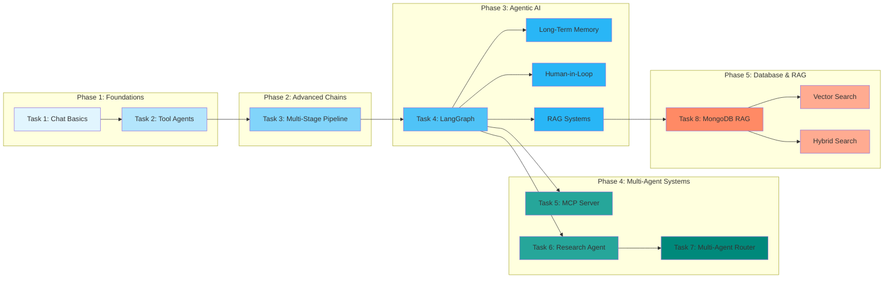

---

## 🧠 Core Concepts Explained

### What is LangChain?

**LangChain** is a framework that simplifies building applications with Large Language Models (LLMs). Think of it as a toolkit that provides:

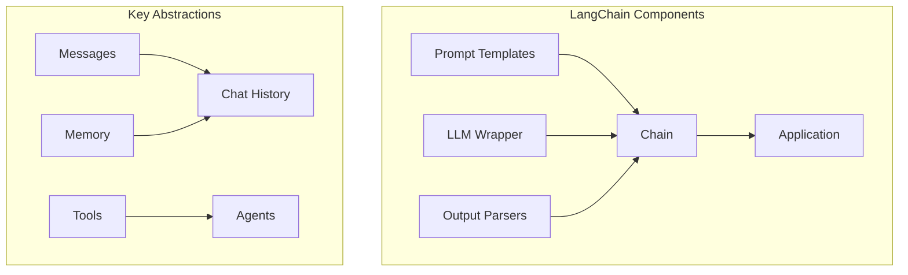

| Component | Purpose | Example |
|-----------|---------|---------|
| **Prompt Template** | Structured way to format prompts | `ChatPromptTemplate.from_messages([...])` |
| **LLM Wrapper** | Unified interface for different LLMs | `ChatGroq`, `ChatOpenAI` |
| **Chain** | Sequence of operations (prompt → LLM → parse) | `prompt \| llm \| parser` |
| **Memory** | Store conversation history | `MessagesPlaceholder` |
| **Tools** | External capabilities for agents | Search, Calculator, APIs |

### What is LangGraph?

**LangGraph** extends LangChain for building **stateful, multi-actor applications** with cycles. It's like a flowchart that can:
- Loop back (cycles)
- Make decisions (conditional edges)
- Remember state across steps (checkpointing)
- Pause for human input (interrupts)

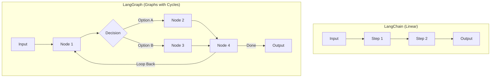

### What is RAG (Retrieval-Augmented Generation)?

RAG combines retrieval (searching documents) with generation (LLM responses) to ground answers in actual data:

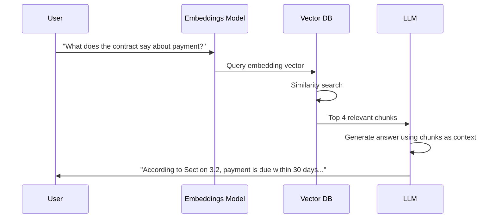

---

## 📁 Repository Structure

```
training/
├── README.md                    # This file - Learning logbook
├── .gitignore                   # Git ignore rules
├── task-1/                      # LangChain Chat Basics
│   ├── app.py                   # Streamlit chat interface
│   ├── chains.py                # LangChain chain composition
│   ├── llm.py                   # LLM configuration (Groq)
│   ├── prompt.py                # Prompt templates
│   └── requirements.txt
├── task-2/                      # Tool-Calling Agents
│   ├── main.py                  # Agentic assistant with tools
│   ├── tools.py                 # Tool definitions (search, calculator, etc.)
│   ├── schema.py                # Pydantic response schemas
│   └── requirements.txt
├── task-3/                      # Multi-Stage Legal Analysis Pipeline
│   ├── app.py                   # Main Streamlit application
│   ├── pipeline.py              # 5-stage analysis pipeline
│   ├── memory.py                # Session state management
│   ├── llm.py                   # LLM configuration
│   ├── config.py                # Application configuration
│   ├── schemas.py               # Pydantic schemas for all stages
│   ├── prompts/                 # Prompt templates per stage
│   │   ├── understand_case.txt
│   │   ├── extract_facts.txt
│   │   ├── identify_issues.txt
│   │   ├── generate_arguments.txt
│   │   └── predict_judgement.txt
│   ├── qna/                     # Q&A system with context builder
│   │   ├── context_builder.py
│   │   ├── qna_engine.py
│   │   ├── qna_memory.py
│   │   └── qna_prompts.txt
│   └── requirements.txt
├── task-4/                      # LangGraph Advanced Concepts
│   ├── app.py                   # RAG-enabled chatbot UI
│   ├── backend.py               # LangGraph state machine + tools
│   ├── hitl_example.py          # Human-in-the-Loop demo
│   ├── langgraph_essay.py       # Parallel evaluation workflow
│   ├── langgraph_chatbot.ipynb  # Basic LangGraph tutorial
│   ├── ltm_basics.ipynb         # Long-Term Memory basics
│   ├── ltm_advance.ipynb        # Advanced LTM patterns
│   ├── chroma_db/               # Persistent vector storage
│   ├── uploaded_documents/      # PDF storage for RAG
│   └── requirements.txt
├── task-5/                      # MCP Server Expense Tracker
│   ├── main.py                  # FastMCP server with tools
│   ├── categories.json          # Expense categories & subcategories
│   ├── pyproject.toml           # Project configuration
│   └── README.md
├── task-6/                      # Research Agent (Web Research)
│   ├── main.py                  # CLI entry point
│   ├── graph.py                 # LangGraph workflow & routing
│   ├── agents.py                # Agent nodes (planner, reader, etc.)
│   ├── tools.py                 # Tool wrappers (Tavily, web scraper)
│   ├── schemas.py               # Pydantic models & state definitions
│   ├── pyproject.toml           # uv dependencies
│   └── README.md
├── task-7/                      # Multi-Agent Routing System
│   ├── main.py                  # CLI entry point (interactive/single query)
│   ├── graph.py                 # LangGraph fan-out workflow
│   ├── classifier.py            # Pure intent classifier (no tools)
│   ├── router.py                # Deterministic routing policy
│   ├── agents.py                # Specialized agents (blog, code, QNA, etc.)
│   ├── schemas.py               # Intent definitions & state schemas
│   ├── logger.py                # Logging & analytics
│   ├── logs/                    # Auto-generated log files
│   └── requirements.txt
├── task-8/                      # MongoDB RAG & Vector Search
│   ├── main.py                  # FastAPI CRUD demo (SQLAlchemy)
│   ├── mongo_rag.ipynb          # MongoDB Atlas Vector Search RAG notebook
│   ├── users.db                 # SQLite database (from main.py)
│   └── requirements.txt
└── .env                         # API keys (not tracked)
```

---

## 📊 Learning Progress

| Task | Topic | Complexity | Status |
|------|-------|------------|--------|
| Task 1 | LangChain Chat Basics | ⭐ Beginner | ✅ Complete |
| Task 2 | Tool-Calling Agents | ⭐⭐ Intermediate | ✅ Complete |
| Task 3 | Multi-Stage Pipelines | ⭐⭐⭐ Advanced | ✅ Complete |
| Task 4 | LangGraph & Long-Term Memory | ⭐⭐⭐⭐ Expert | ✅ Complete |
| Task 5 | MCP Server (Expense Tracker) | ⭐⭐ Intermediate | ✅ Complete |
| Task 6 | Research Agent (Web Research) | ⭐⭐⭐⭐ Expert | ✅ Complete |
| Task 7 | Multi-Agent Routing System | ⭐⭐⭐⭐ Expert | ✅ Complete |
| Task 8 | MongoDB RAG & Vector Search | ⭐⭐⭐ Advanced | ✅ Complete |

---

## 📘 Task-1: LangChain Chat Basics

### 🎯 Learning Objectives
- Understand LangChain fundamentals
- Build a basic chatbot with conversation history
- Learn prompt templating with `ChatPromptTemplate`
- Use `MessagesPlaceholder` for dynamic chat history

### 🏗️ Architecture

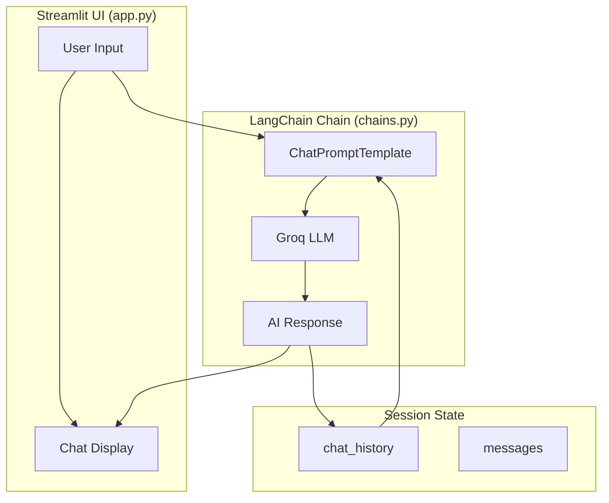

### 🧩 How It Works

#### The LCEL (LangChain Expression Language) Pipeline

LCEL uses the **pipe operator (`|`)** to chain components together. Data flows left to right:

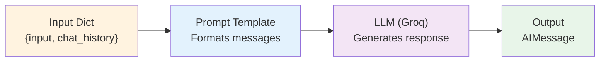

```python
# chains.py - The pipe operator creates a processing pipeline
chain = prompt | llm  # prompt output becomes llm input
```

#### Message Types in LangChain

| Message Type | Purpose | Created By |
|--------------|---------|------------|
| `SystemMessage` | Sets assistant behavior | Developer |
| `HumanMessage` | User's input | User |
| `AIMessage` | LLM's response | LLM |
| `ToolMessage` | Tool execution results | Tools |

#### Code Walkthrough

**`llm.py`** - LLM Configuration:
```python
from langchain_groq import ChatGroq

llm = ChatGroq(
    model="qwen/qwen3-32b",    # Model to use
    temperature=0.1,            # Lower = more deterministic
    max_tokens=None,            # No limit
    max_retries=2,              # Retry on failure
)
```

**`prompt.py`** - Prompt Template:
```python
def create_prompt():
    return ChatPromptTemplate.from_messages([
        ("system", "You are a helpful assistant..."),  # Fixed instruction
        MessagesPlaceholder(variable_name="chat_history"),  # Dynamic history
        ("human", "{input}")  # Current user message
    ])
```

**`app.py`** - Streamlit Integration:
```python
# Invoke the chain with both current input and history
response = st.session_state.chain.invoke({
    "input": user_input,
    "chat_history": st.session_state.chat_history
})

# Update history for next turn
st.session_state.chat_history.append(HumanMessage(content=user_input))
st.session_state.chat_history.append(AIMessage(content=bot_reply))
```

### 📊 Chat History Flow Diagram

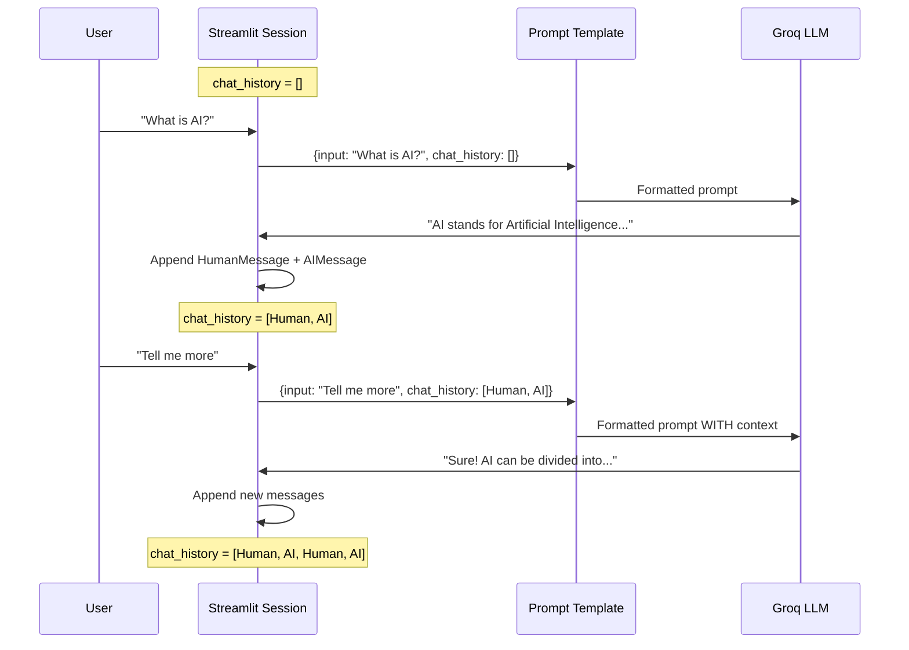

### 🔧 Technologies Used
- **LangChain Core**: `ChatPromptTemplate`, `MessagesPlaceholder`
- **LangChain Groq**: `ChatGroq` for LLM inference
- **Model**: `qwen/qwen3-32b` (via Groq)
- **UI**: Streamlit

---

## 🛠️ Task-2: Tool-Calling Agents

### 🎯 Learning Objectives
- Understand the **ReAct (Reasoning + Acting)** pattern
- Build an agent that can use external tools
- Learn tool definition with schemas
- Implement structured output parsing
- Handle agent iterations and error recovery

### 🏗️ Architecture

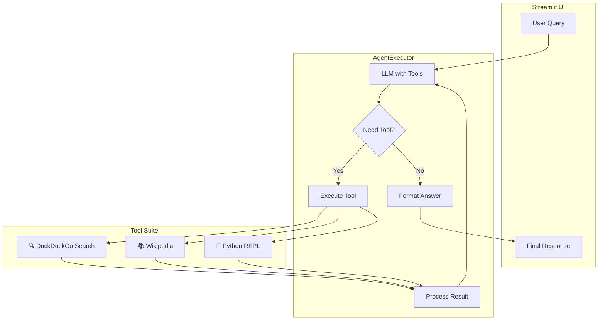

### 🧠 Understanding the ReAct Pattern

**ReAct** stands for **Re**asoning + **Act**ing. It's a prompting strategy where the LLM:

1. **Thinks** about what to do (Reasoning)
2. **Acts** by calling a tool (Acting)
3. **Observes** the tool's output
4. **Repeats** until it can answer

```mermaid
stateDiagram-v2
    [*] --> Thought: User Query
    Thought --> Action: Decide tool needed
    Action --> Observation: Execute tool
    Observation --> Thought: Process result
    Thought --> FinalAnswer: Have enough info
    FinalAnswer --> [*]
    
    note right of Thought: "I need to calculate 2^100"
    note right of Action: "python_interpreter"
    note right of Observation: "Result: 1.27e30"
```

### 📝 Code Deep Dive

#### Tool Definition in `tools.py`

Tools are functions that the LLM can call. Each tool has:
- **Name**: Identifier the LLM uses
- **Description**: Helps LLM decide when to use it
- **Schema**: Validates inputs (Pydantic)
- **Function**: The actual code to execute

```python
# Simple Tool - just function + description
tools = [
    Tool(
        name="duckduckgo_search",
        func=DuckDuckGoSearchRun().run,
        description="Search the live web for current events, news, and real-time data."
    ),
]

# Structured Tool - with input validation
class PythonInterpreterInput(BaseModel):
    """Input schema for python interpreter tool."""
    code: str = Field(description="The Python code to execute.")

StructuredTool(
    name="python_interpreter",
    func=python_interpreter_wrapper,
    description="Execute python code for complex math or logic.",
    args_schema=PythonInterpreterInput  # Pydantic validation
)
```

#### Agent Executor Configuration in `main.py`

```python
# Create the agent (LLM + Tools + Prompt)
agent = create_tool_calling_agent(llm, tools, prompt)

# AgentExecutor runs the ReAct loop
agent_executor = AgentExecutor(
    agent=agent, 
    tools=tools, 
    verbose=True,              # Show reasoning steps
    max_iterations=15,         # Prevent infinite loops
    early_stopping_method="force",  # Stop safely if stuck
    handle_parsing_errors=True,     # Recover from malformed outputs
    return_intermediate_steps=True  # Access tool calls for debugging
)
```

#### Structured Output with `schema.py`

```python
class AssistantResponse(BaseModel):
    """Ensures consistent, validated output structure."""
    reasoning: str = Field(description="Step-by-step logic used")
    answer: str = Field(description="The final concise answer")
    tools_used: List[str] = Field(description="List of tools accessed")
    confidence: float = Field(description="Confidence score 0-1")
```

### 📊 ReAct Execution Flow

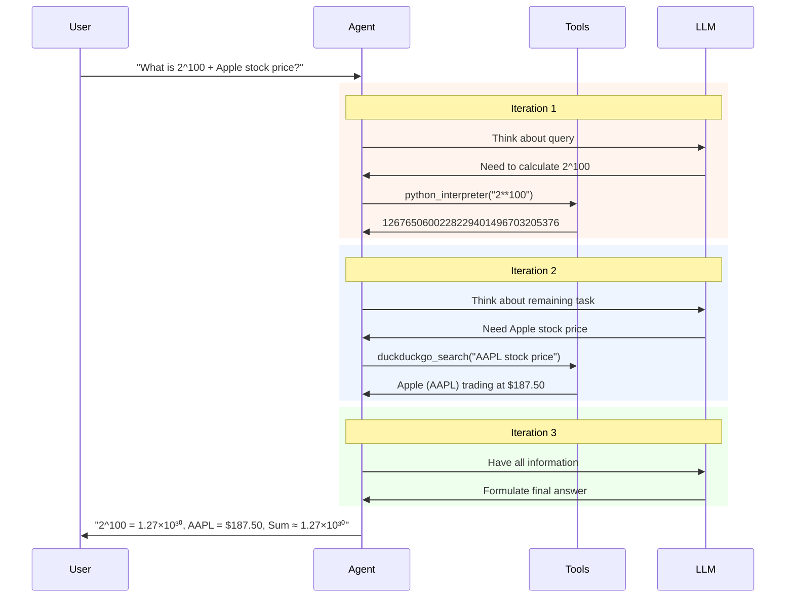

### 🔧 Technologies Used
- **LangChain Classic**: `AgentExecutor`, `create_tool_calling_agent`
- **Tools**: DuckDuckGoSearch, WikipediaQuery, PythonREPL
- **Model**: `llama-3.3-70b-versatile` (via Groq)
- **Callbacks**: `StreamlitCallbackHandler` for real-time UI updates

---

## ⚖️ Task-3: Multi-Stage Pipeline (Legal Case Analysis)

### 🎯 Learning Objectives
- Build a **multi-stage LLM pipeline** where outputs flow between stages
- Implement **structured JSON output** with repair mechanisms
- Create a **context-aware Q&A system** over analysis results
- Learn memory management for both pipeline state and conversations
- Design **modular prompt engineering** with external template files

### 🏗️ Architecture

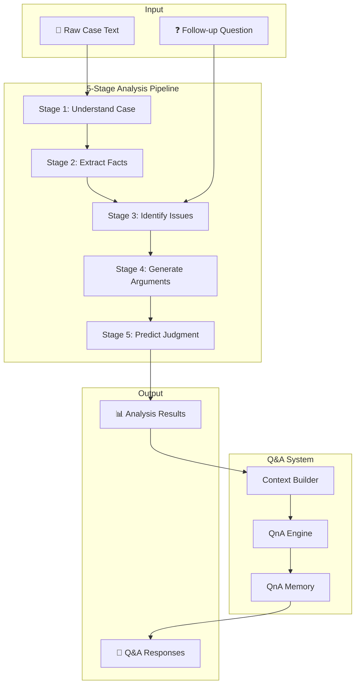

### 🧠 Understanding the Multi-Stage Pipeline

Each stage in the pipeline has a specific role and passes structured data to the next stage:

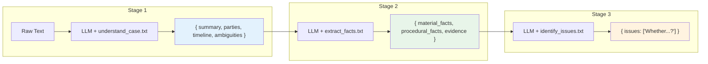

### 📊 Pipeline Stage Details

| Stage | Input | Output Schema | Prompt File | Purpose |
|-------|-------|---------------|-------------|---------|
| **1. Understand Case** | Raw case text | `CaseUnderstanding` | `understand_case.txt` | Paraphrase without legal conclusions |
| **2. Extract Facts** | Understanding | `ExtractedFacts` | `extract_facts.txt` | Separate facts from interpretation |
| **3. Identify Issues** | Facts + Follow-up | `LegalIssues` | `identify_issues.txt` | Spot legal issues as questions |
| **4. Generate Arguments** | Facts + Issues | `ArgumentsByIssue` | `generate_arguments.txt` | Balanced argument generation |
| **5. Predict Judgment** | Facts + Issues + Args | `JudgmentPrediction` | `predict_judgement.txt` | Cautious prediction with assumptions |

### 📝 Code Deep Dive

#### Pipeline Execution Flow (`pipeline.py`)

```python
def run_llm(prompt_text: str, variables: Dict, max_tokens: int = None) -> Dict:
    """Core function that runs each pipeline stage."""
    llm = get_llm(max_tokens=max_tokens)
    
    prompt = ChatPromptTemplate.from_messages([
        ("system", prompt_text),  # Loaded from .txt file
        ("human", "{input}")      # Variables as JSON
    ])
    
    chain = prompt | llm | StrOutputParser()
    
    raw_output = chain.invoke({"input": json.dumps(variables)})
    
    # Extract and repair JSON from LLM output
    json_text = extract_json_from_text(raw_output)
    json_text = repair_json(json_text)  # Fix common LLM JSON errors
    
    return json.loads(json_text)
```

#### JSON Repair Mechanism

LLMs sometimes produce malformed JSON. The repair function fixes common issues:

```python
def repair_json(json_text: str) -> str:
    """Fix common LLM JSON issues."""
    # Fix: Missing comma after ] or } before "
    # Example: ]["key"  →  ], "key"
    json_text = re.sub(r'([\]}])\s*\n\s*(")', r'\1,\n\2', json_text)
    
    # Fix: Trailing comma before closing bracket
    # Example: ["item",]  →  ["item"]
    json_text = re.sub(r',(\s*[}\]])', r'\1', json_text)
    
    return json_text
```

#### Pydantic Schemas (`schemas.py`)

```python
class CaseUnderstanding(BaseModel):
    summary: str = Field(..., description="Plain-language summary")
    parties: List[str] = Field(..., description="Parties involved")
    timeline: List[str] = Field(..., description="Chronological events")
    ambiguities: List[str] = Field(..., description="Unclear facts")

class ArgumentSide(BaseModel):
    points: List[str] = Field(..., description="Key arguments")
    relied_facts: List[str] = Field(..., description="Facts relied upon")

class IssueArguments(BaseModel):
    side_a: ArgumentSide  # Plaintiff/Prosecution
    side_b: ArgumentSide  # Defendant
    strength: Literal["weak", "moderate", "strong"]
```

#### Context-Aware Q&A (`qna/context_builder.py`)

The Q&A system only includes relevant context based on keywords in the question:

```python
# Keyword buckets for intelligent context selection
ARGUMENT_KEYWORDS = {"argument", "claim", "defense", "plaintiff", "defendant"}
JUDGMENT_KEYWORDS = {"judgment", "outcome", "result", "win", "lose"}

def build_context(question: str, analysis_memory: Dict) -> Dict:
    """Build minimal, relevant context based on question."""
    question_lower = question.lower()
    context = {}
    
    # Only include arguments if question is about arguments
    if any(word in question_lower for word in ARGUMENT_KEYWORDS):
        context["arguments"] = analysis_memory.get("arguments")
    
    # Only include judgment if question is about outcome
    if any(word in question_lower for word in JUDGMENT_KEYWORDS):
        context["judgment"] = analysis_memory.get("judgment")
    
    return context  # Smaller context = better answers + lower cost
```

### 📊 Data Flow Through Pipeline

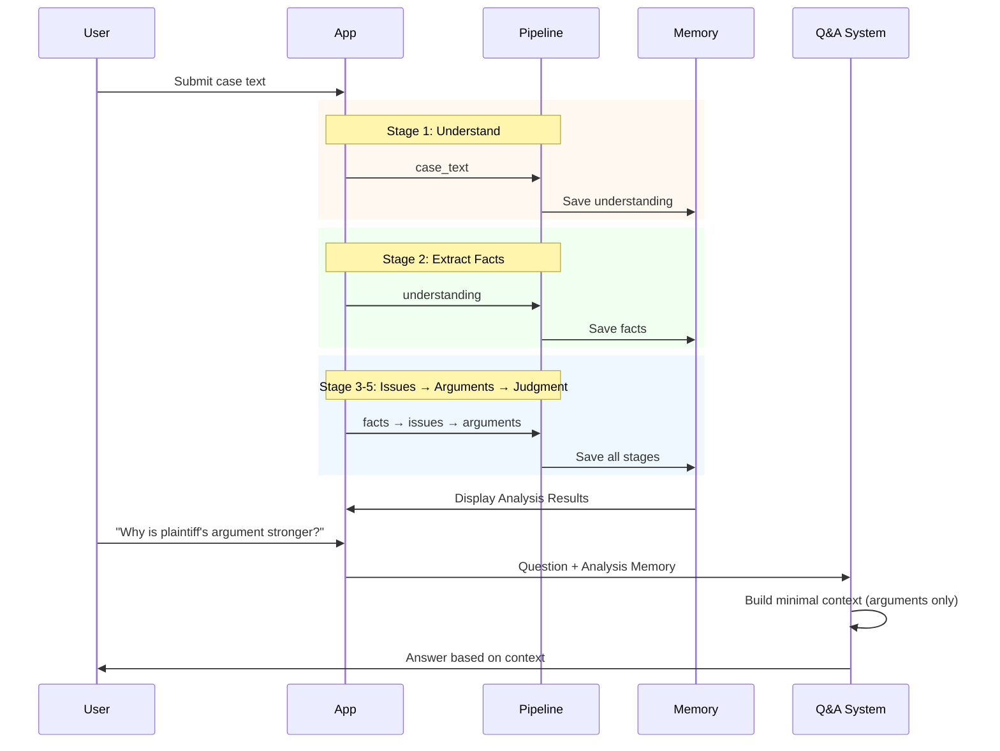

### 🔧 Technologies Used
- **Prompt Management**: External `.txt` template files for easy editing
- **JSON Repair**: Custom regex-based repair utilities
- **Memory**: Streamlit session state for pipeline stages + Q&A history
- **Model**: `moonshotai/kimi-k2-instruct-0905` (via Groq)

---

## 🔄 Task-4: LangGraph & Advanced Agentic AI

### 🎯 Learning Objectives
- Master **LangGraph** for stateful, multi-node agentic workflows
- Implement **checkpointing** for conversation persistence
- Build **Human-in-the-Loop (HITL)** systems with `interrupt()`
- Create **RAG pipelines** with ChromaDB vector storage
- Understand **Long-Term Memory (LTM)** patterns with InMemoryStore
- Learn **parallel node execution** for fan-out workflows

### 📁 Task-4 Components Overview

| File | Purpose | Key Concepts |
|------|---------|--------------|
| `langgraph_chatbot.ipynb` | Basic LangGraph intro | StateGraph, MemorySaver, checkpointing |
| `ltm_basics.ipynb` | Long-Term Memory fundamentals | InMemoryStore, namespaces, semantic search |
| `ltm_advance.ipynb` | Advanced LTM patterns | Memory extraction, deduplication, merged workflow |
| `langgraph_essay.py` | Parallel evaluation workflow | Fan-out pattern, score aggregation |
| `hitl_example.py` | Human-in-the-Loop demo | `interrupt()`, `Command(resume=...)` |
| `app.py` + `backend.py` | Full RAG chatbot | PDF ingestion, tool selection, async checkpointing |

---

### 📘 4.1 LangGraph Basics (`langgraph_chatbot.ipynb`)

#### What is a StateGraph?

A **StateGraph** is a directed graph where:
- **Nodes** = Functions that transform state
- **Edges** = Control flow between nodes
- **State** = Shared data structure (like a TypedDict)

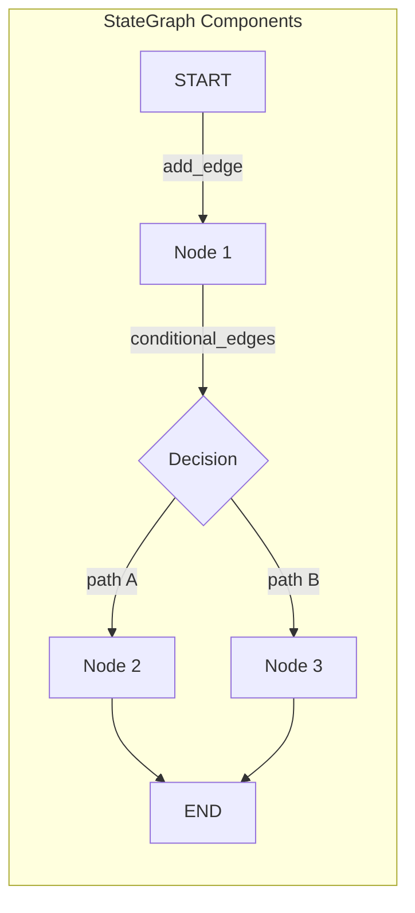

#### Core Concepts Explained

**1. State Definition with `add_messages`:**
```python
from typing import TypedDict, Annotated
from langgraph.graph.message import add_messages

class ChatState(TypedDict):
    # Annotated with add_messages = messages accumulate, not replace
    messages: Annotated[list[BaseMessage], add_messages]
```

The `add_messages` reducer means each node's output gets **appended** to the list, not replaced.

**2. Graph Construction:**
```python
from langgraph.graph import StateGraph, START, END

graph = StateGraph(ChatState)
graph.add_node('chat_node', chat_node)  # Register node
graph.add_edge(START, 'chat_node')       # START → chat_node
graph.add_edge('chat_node', END)         # chat_node → END
```

**3. Checkpointing (Memory Persistence):**
```python
from langgraph.checkpoint.memory import MemorySaver

checkpointer = MemorySaver()  # In-memory (for dev)
# Or: AsyncSqliteSaver for production

chatbot = graph.compile(checkpointer=checkpointer)

# Each thread_id maintains separate conversation history
result = chatbot.invoke(
    {"messages": [HumanMessage(content="Hi")]},
    config={"configurable": {"thread_id": "user-123"}}
)
```

#### Architecture Diagram

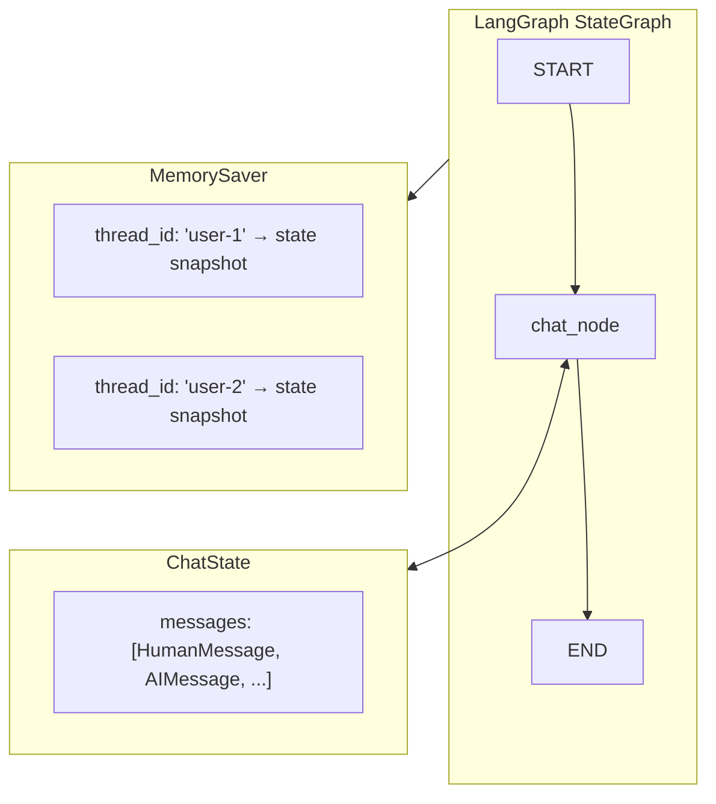

---

### 📗 4.2 Long-Term Memory Basics (`ltm_basics.ipynb`)

#### What is InMemoryStore?

**InMemoryStore** is LangGraph's key-value store for persisting user data across sessions. Think of it as a database organized by **namespaces** (like folders).

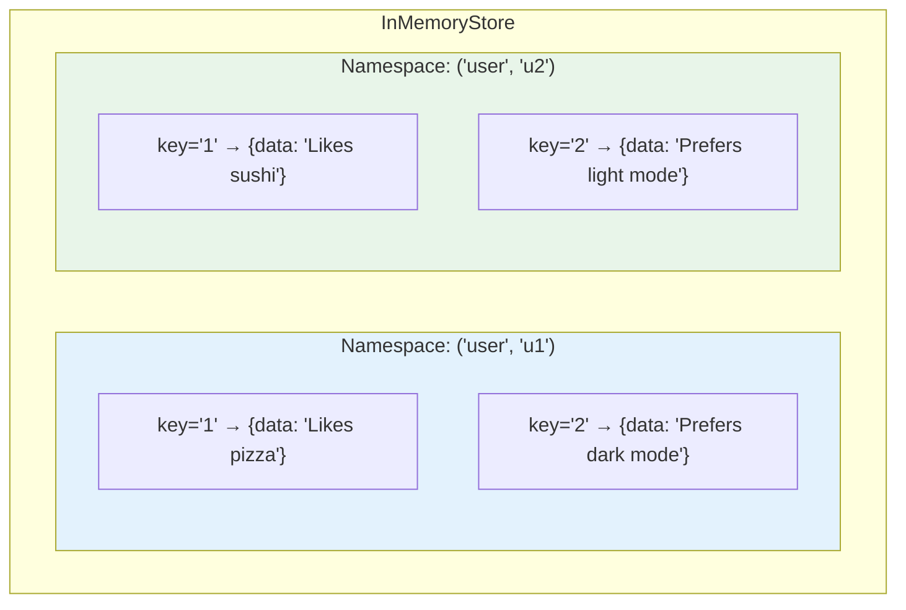

#### CRUD Operations

```python
from langgraph.store.memory import InMemoryStore

store = InMemoryStore()

# CREATE: store.put(namespace, key, value)
namespace = ("user", "u1")
store.put(namespace, "1", {"data": "User likes pizza"})
store.put(namespace, "2", {"data": "User prefers dark mode"})

# READ: store.get(namespace, key)
item = store.get(namespace, "1")  # Returns SearchItem

# SEARCH: store.search(namespace, query=..., limit=...)
items = store.search(namespace)  # Get all in namespace
items = store.search(namespace, query="preferences", limit=3)  # Semantic search

# DELETE: store.delete(namespace, key)
store.delete(namespace, "1")
```

#### Semantic Search with Embeddings

When you create the store with an embedding model, `search()` becomes semantic:

```python
from langchain_ollama import OllamaEmbeddings

embeddings = OllamaEmbeddings(model="nomic-embed-text")
store = InMemoryStore(index={'embed': embeddings, 'dims': 1536})

# Now search finds semantically similar items
items = store.search(namespace, query="what does user like to eat", limit=1)
# Returns: {"data": "User likes pizza"} (even though "pizza" ≠ "eat")
```

---

### 📙 4.3 Advanced Long-Term Memory (`ltm_advance.ipynb`)

#### Three LTM Patterns

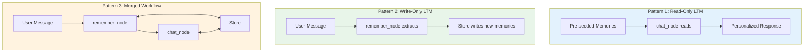

#### Memory Extraction with Deduplication

The key challenge: **How to avoid storing duplicate memories?**

Solution: Use LLM to compare new info against existing memories:

```python
class MemoryItem(BaseModel):
    text: str = Field(description="Atomic user memory")
    is_new: bool = Field(description="True if NEW, false if duplicate")

class MemoryDecision(BaseModel):
    should_write: bool
    memories: List[MemoryItem]

MEMORY_PROMPT = """
CURRENT USER DETAILS (existing memories):
{user_details_content}

TASK:
- Extract user-specific info from the message
- For each item, set is_new=true ONLY if it adds NEW information
- If same meaning as existing memory, set is_new=false
"""

# Only store truly new memories
if decision.should_write:
    for mem in decision.memories:
        if mem.is_new:  # Skip duplicates
            store.put(namespace, str(uuid.uuid4()), {"data": mem.text})
```

#### Merged Workflow: Read + Write

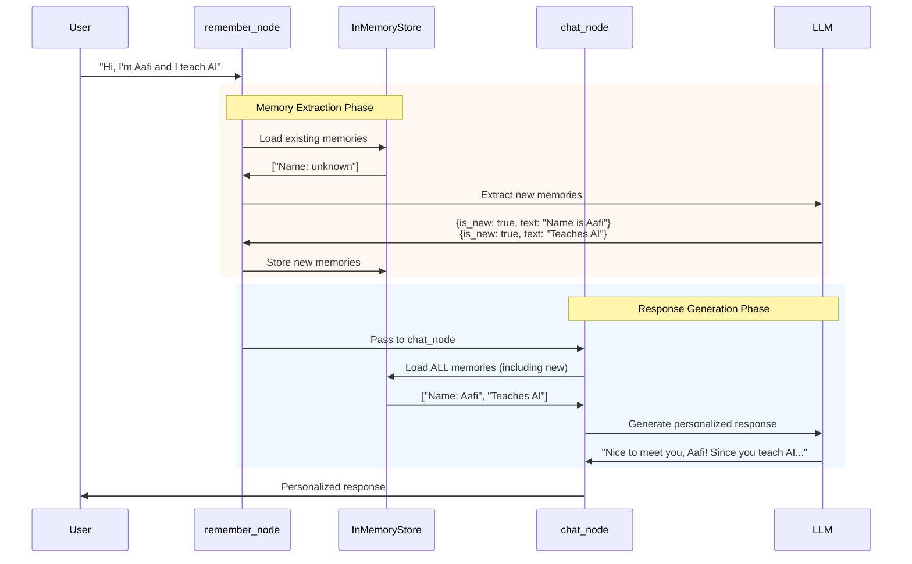

---

### 📕 4.4 Parallel Evaluation Workflow (`langgraph_essay.py`)

#### Fan-Out/Fan-In Pattern

When multiple nodes have the same source, they execute **in parallel**:

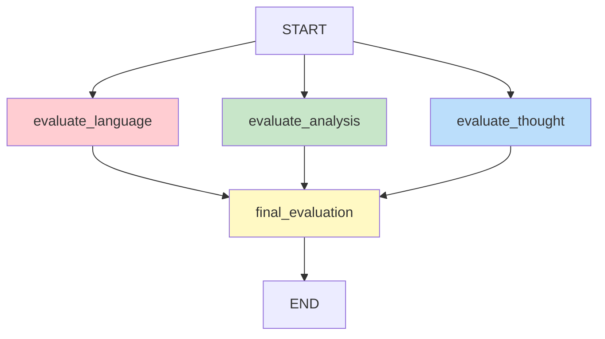

#### State with Score Aggregation

```python
from typing import Annotated
import operator

class UPSCState(TypedDict):
    essay: str
    language_feedback: str
    analysis_feedback: str
    clarity_feedback: str
    overall_feedback: str
    # operator.add = merge lists from parallel nodes
    individual_scores: Annotated[List[int], operator.add]
    avg_score: float
```

The `operator.add` reducer automatically combines scores from parallel nodes:

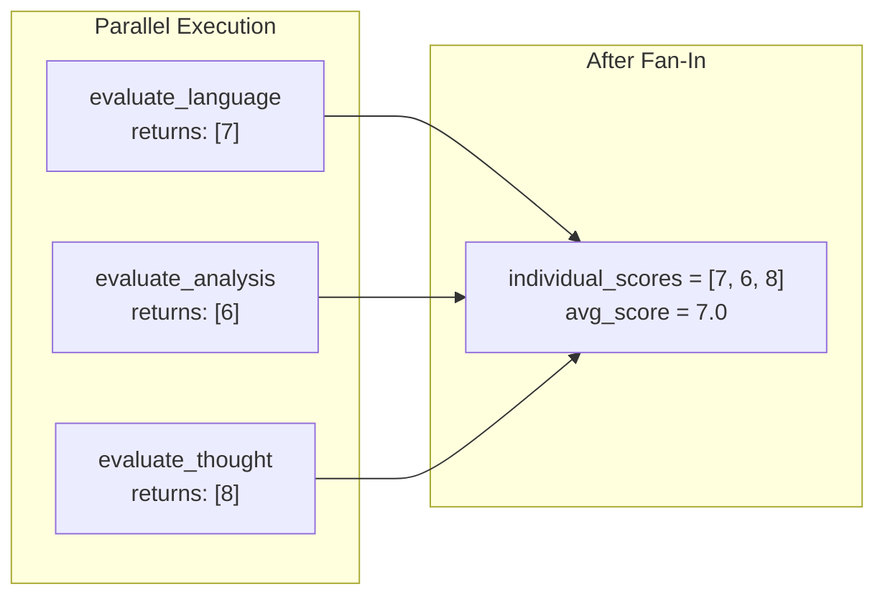

---

### 📘 4.5 Human-in-the-Loop (`hitl_example.py`)

#### The `interrupt()` Function

**interrupt()** pauses graph execution and returns control to the caller (human). The graph state is saved, waiting for human input.

```mermaid
sequenceDiagram
    participant U as User
    participant G as Graph
    participant T as Tool
    participant H as Human
    
    U->>G: "Buy 10 AAPL shares"
    G->>T: Call purchase_stock
    T->>T: interrupt("Approve?")
    T-->>G: Graph PAUSED
    G-->>H: "Approve buying 10 shares?"
    
    Note over G,H: ⏸️ Execution Paused
    
    H->>G: Command(resume="yes")
    G->>T: Resume with "yes"
    T->>T: Process approval
    T->>G: "Purchase successful"
    G->>U: "Bought 10 AAPL shares"
```

#### Code Implementation

```python
from langgraph.types import interrupt, Command

@tool
def purchase_stock(symbol: str, quantity: int) -> str:
    """Purchase stock - requires human approval."""
    # PAUSE execution here
    decision = interrupt(f"Approve buying {quantity} shares of {symbol}? (yes/no)")
    
    # This code runs AFTER human responds
    if decision.lower() == "yes":
        return f"SUCCESS: Purchased {quantity} shares of {symbol}"
    else:
        return f"CANCELLED: Purchase declined by human"

# In the main loop:
result = chatbot.invoke(state, config)

# Check if graph is waiting for human
if result.get("__interrupt__"):
    prompt = result["__interrupt__"][0].value
    human_decision = input(f"HITL: {prompt}")
    
    # Resume execution with human's decision
    result = chatbot.invoke(
        Command(resume=human_decision),
        config
    )
```

---

### 📗 4.6 Full RAG Chatbot (`app.py` + `backend.py`)

#### Complete System Architecture

```mermaid
flowchart TB
    subgraph UI["Streamlit UI (app.py)"]
        A[Chat Interface]
        B[PDF Upload]
        C[Session Selector]
    end
    
    subgraph Backend["Backend (backend.py)"]
        subgraph Graph["LangGraph State Machine"]
            D[START] --> E[chat_node]
            E --> F{tools_condition}
            F -->|needs tool| G[tools_node]
            G --> E
            F -->|done| H[END]
        end
        
        subgraph Tools["Tool Suite"]
            I[🔍 web_search]
            J[🧮 calculator]
            K[📈 get_stock]
            L[📄 document_search]
        end
    end
    
    subgraph Storage["Persistent Storage"]
        M[(ChromaDB<br/>Vector Store)]
        N[(SQLite<br/>Checkpoints)]
        O[PDF Files]
    end
    
    A --> E
    G --> I & J & K & L
    L <--> M
    E <--> N
    B --> O --> M
```

#### PDF Ingestion Pipeline

```mermaid
flowchart LR
    subgraph Input
        A[PDF Upload]
    end
    
    subgraph Processing
        B[PDFPlumberLoader] --> C[RecursiveTextSplitter]
        C --> D[1000 char chunks<br/>200 overlap]
    end
    
    subgraph Embedding
        D --> E[Ollama Embeddings<br/>nomic-embed-text]
        E --> F[Vector representations]
    end
    
    subgraph Storage
        F --> G[(ChromaDB<br/>Persistent Collection)]
    end
    
    A --> B
```

#### Document Deduplication System

```mermaid
flowchart TB
    A[PDF Uploaded] --> B[Compute SHA256 Hash]
    B --> C{Hash in<br/>document_hashes.json?}
    
    C -->|Yes: CACHE HIT| D[Load existing collection]
    D --> E["⚡ Instant (no re-embedding)"]
    
    C -->|No: CACHE MISS| F[Process PDF]
    F --> G[Chunk text]
    G --> H[Generate embeddings]
    H --> I[Store in ChromaDB]
    I --> J[Save hash mapping]
    
    E --> K[Create Retriever]
    J --> K
```

#### Tool Selection Logic

The LLM automatically selects the right tool based on the query:

```mermaid
flowchart TB
    Q[User Query] --> A{Contains 'document'<br/>'PDF', 'uploaded'?}
    A -->|Yes| T1[📄 document_search]
    A -->|No| B{Contains math<br/>or 'calculate'?}
    B -->|Yes| T2[🧮 calculator]
    B -->|No| C{Contains 'stock'<br/>'price', ticker?}
    C -->|Yes| T3[📈 get_stock_price]
    C -->|No| T4[🔍 web_search]
```

### 🔧 Technologies Used (Task-4)
- **LangGraph**: StateGraph, MemorySaver, AsyncSqliteSaver, InMemoryStore
- **Vector DB**: ChromaDB (persistent), Ollama embeddings (nomic-embed-text)
- **PDF Processing**: PDFPlumber, RecursiveCharacterTextSplitter
- **Tools**: DuckDuckGo, Calculator, Stock API (Alpha Vantage), Document Search
- **Model**: `llama-3.1-8b-instant` (via Groq)
- **Async**: aiosqlite, httpx for non-blocking operations

---

## � Task-5: MCP Server (Expense Tracker)

### 🎯 Learning Objectives
- Understand Model Context Protocol (MCP) fundamentals
- Build an MCP server using FastMCP framework
- Create tools that interact with SQLite database
- Expose resources via MCP protocol
- Learn tool decoration and resource patterns

### 🏗️ Architecture

```mermaid
flowchart TB
    subgraph MCP["MCP Server (FastMCP)"]
        A[ExpenseTracker Server] --> B[SQLite Database]
    end
    
    subgraph Tools["MCP Tools"]
        T1[add_expense] --> B
        T2[list_expenses] --> B
        T3[summarize] --> B
    end
    
    subgraph Resources["MCP Resources"]
        R1[expense://categories] --> C[categories.json]
    end
    
    subgraph Client["MCP Client"]
        D[AI Assistant / LLM] --> MCP
    end
```

### 🧩 How It Works

#### Model Context Protocol (MCP)

MCP is an open protocol that enables AI assistants to interact with external tools and data sources. FastMCP provides a simple decorator-based approach:

```python
from fastmcp import FastMCP

mcp = FastMCP("ExpenseTracker")

@mcp.tool()
def add_expense(date, amount, category, subcategory="", note=""):
    '''Add a new expense entry to the database.'''
    # Tool implementation
    pass

@mcp.resource("expense://categories", mime_type="application/json")
def categories():
    # Resource implementation
    pass
```

### 📁 Task-5 Components Overview

| File | Purpose | Key Concepts |
|------|---------|-------------|
| `main.py` | MCP server definition | FastMCP, tools, resources |
| `categories.json` | Expense categories data | JSON resource, hierarchical data |
| `pyproject.toml` | Project configuration | Dependencies, scripts |
| `expenses.db` | SQLite database (auto-created) | Persistent storage |

### 🔧 MCP Tools Defined

| Tool | Description | Parameters |
|------|-------------|------------|
| `add_expense` | Add a new expense entry | `date`, `amount`, `category`, `subcategory`, `note` |
| `list_expenses` | List expenses in date range | `start_date`, `end_date` |
| `summarize` | Summarize by category | `start_date`, `end_date`, `category` (optional) |

### 📊 Expense Categories

The server provides a comprehensive categorization system:

| Category | Example Subcategories |
|----------|----------------------|
| **food** | groceries, dining_out, coffee_tea, delivery_fees |
| **transport** | fuel, public_transport, cab_ride_hailing, parking |
| **housing** | rent, maintenance_hoa, property_tax, repairs_service |
| **utilities** | electricity, water, gas, internet_broadband, mobile_phone |
| **health** | medicines, doctor_consultation, fitness_gym |
| **education** | books, courses, online_subscriptions |

### 🚀 Running Task-5

```bash
# Install dependencies
cd task-5
pip install fastmcp

# Run the MCP server
python main.py

# Or using the script defined in pyproject.toml
task-5
```

### 🔧 Technologies Used (Task-5)
- **FastMCP**: Framework for building MCP servers
- **SQLite**: Lightweight embedded database for expense storage
- **MCP Protocol**: Standard protocol for AI tool integration
- **Python 3.10+**: Required runtime

---

## 🔬 Task-6: Research Agent (Multi-Stage Web Research)

### 🎯 Learning Objectives
- Build a **robust multi-stage research pipeline** using LangGraph
- Implement **graceful error handling** where tools never throw exceptions
- Design **three types of state**: short-term, research memory, failure memory
- Use **verification before synthesis** to reduce hallucinations
- Create tools that return standardized `ToolResponse` objects
- Handle partial failures with fallback strategies

### 🏗️ Architecture

```mermaid
flowchart TB
    subgraph Input["User Query"]
        A["❓ Research Question"]
    end
    
    subgraph Planner["🎯 PLANNER NODE"]
        B["Convert vague intent → research plan"]
        B1["Generate 3-5 search queries"]
        B2["Define quality constraints"]
    end
    
    subgraph Search["🔍 SEARCH NODE"]
        C["Execute Tavily searches"]
        C1["Capture metadata per result"]
        C2["Assign confidence hints"]
    end
    
    subgraph Reader["📖 READER NODE"]
        D["Fetch full articles"]
        D1["httpx + BeautifulSoup"]
        D2["Fallback: LangChain WebBaseLoader"]
        D3["Final: Snippet-only extraction"]
        D4["Extract: claims, evidence, stats, bias"]
    end
    
    subgraph Verifier["✅ VERIFIER NODE"]
        E["Cross-check claims across sources"]
        E1["Confirmed points"]
        E2["Disputed points"]
        E3["Single-source claims"]
    end
    
    subgraph Synthesizer["📝 SYNTHESIZER NODE"]
        F["Synthesize ACROSS sources"]
        F1["Rate evidence strength"]
        F2["Identify open questions"]
    end
    
    subgraph Answer["💬 ANSWER NODE"]
        G["Generate final response"]
        G1["Markdown formatting"]
        G2["Inline citations"]
        G3["Confidence section"]
    end
    
    A --> B
    B --> B1 --> B2 --> C
    C --> C1 --> C2 --> D
    D --> D1 --> D2 --> D3 --> D4 --> E
    E --> E1 --> E2 --> E3 --> F
    F --> F1 --> F2 --> G
    G --> G1 --> G2 --> G3
```

### 🔑 Key Design Principles

#### 1. Tools Never Throw Exceptions
Every tool returns a standardized response - **no exceptions bubble up**:

```python
class ToolResponse(BaseModel):
    success: bool
    data: Optional[dict | list | str] = None
    error: Optional[str] = None
    retry_suggestion: Optional[str] = None
```

#### 2. Graceful Degradation Flow

```mermaid
flowchart LR
    A["Tool Called"] --> B{"Success?"}
    B -->|Yes| C["Next Step"]
    B -->|No| D["Retry with modification"]
    D --> E{"Retry worked?"}
    E -->|Yes| C
    E -->|No| F["Fallback strategy"]
    F --> G{"Fallback worked?"}
    G -->|Yes| C
    G -->|No| H["Log failure, continue with partial results"]
    H --> C
```

#### 3. Three Types of State

| State Type | Contents | Purpose |
|------------|----------|--------|
| **Short-term** | `current_step`, `retry_count`, tool outputs | Current execution context |
| **Research Memory** | `research_plan`, `search_results`, `extracted_notes`, `verification`, `synthesis` | Accumulated knowledge |
| **Failure Memory** | `failures` list with operation, target, error, timestamp | Learning from failures |

#### 4. Extract Before Synthesizing

Reader outputs are **structured notes**, not summaries:

```python
class ExtractedNotes(BaseModel):
    url: str
    title: str
    key_claims: list[str]      # Main assertions
    evidence: list[str]        # Supporting facts/studies
    data_stats: list[str]      # Numbers, percentages, dates
    limitations: list[str]     # Caveats, gaps
    author_bias: Optional[str] # Detected perspective
    confidence: Literal["HIGH", "MEDIUM", "LOW"]
    extraction_method: Literal["FULL", "SNIPPET_ONLY", "FAILED"]
```

#### 5. Verification Layer (Critical!)

Before synthesis, cross-check claims:
- **Confirmed points**: Multiple sources agree
- **Disputed points**: Sources contradict each other  
- **Single-source claims**: Flagged for caution

This reduces hallucinations more than any prompt engineering.

### 📊 Source Confidence Levels

```mermaid
flowchart TB
    subgraph HIGH["🟢 HIGH Confidence"]
        H1[".gov, .edu domains"]
        H2["nature.com, science.org"]
        H3["arxiv.org, pubmed"]
        H4["ieee.org, acm.org, springer.com"]
    end
    
    subgraph MEDIUM["🟡 MEDIUM Confidence"]
        M1["Established news"]
        M2["Reputable tech blogs"]
        M3["Company documentation"]
    end
    
    subgraph LOW["🔴 LOW Confidence"]
        L1["reddit.com, quora.com"]
        L2["medium.com (user blogs)"]
        L3["Opinion pieces, forums"]
    end
```

### 📝 Key Code Patterns

#### LangGraph State Definition
```python
class AgentState(TypedDict, total=False):
    # Input
    user_question: str
    
    # Short-term state
    current_step: str
    retry_count: int
    max_retries: int
    
    # Research memory
    research_plan: Optional[dict]
    search_results: list[dict]
    extracted_notes: list[dict]
    verification: Optional[dict]
    synthesis: Optional[dict]
    
    # Failure memory
    failures: list[dict]
    
    # Output
    final_answer: Optional[str]
    citations: list[str]
    
    # Control flow
    should_continue: bool
    error_state: Optional[str]
```

#### Planner Node Output
```python
class ResearchPlan(BaseModel):
    objective: str                    # What we're trying to learn
    sub_questions: list[str]          # Broken-down aspects
    search_queries: list[str]         # 3-5 specific queries
    quality_constraints: list[str]    # Source quality requirements
    max_searches: int = 5
    max_articles_per_search: int = 3
```

#### Error-Resilient Tool Pattern
```python
def fetch_article(self, url: str, snippet_fallback: Optional[str] = None) -> ToolResponse:
    # Try primary fetch
    try:
        result = self._fetch_with_httpx(url)
        if result.success:
            return result
    except Exception:
        pass  # Continue to fallback
    
    # Try LangChain fallback
    try:
        result = self._fetch_with_langchain(url)
        if result.success:
            return result
    except Exception:
        pass
    
    # Final fallback: use snippet
    if snippet_fallback:
        return ToolResponse(
            success=True,
            data={"content": snippet_fallback, "extraction_method": "SNIPPET_ONLY"}
        )
    
    return ToolResponse(success=False, error="All fetch methods failed")
```

### 🔄 LangGraph Workflow

```mermaid
stateDiagram-v2
    [*] --> Planner
    Planner --> Search: success
    Planner --> ErrorHandler: error
    
    Search --> Reader: has results
    Search --> ErrorHandler: all searches failed
    
    Reader --> Verifier: has notes
    Reader --> ErrorHandler: no notes extracted
    
    Verifier --> Synthesizer: always continues
    
    Synthesizer --> Answer: success
    Synthesizer --> ErrorHandler: error
    
    Answer --> [*]
    ErrorHandler --> [*]: partial results
```

### 📁 Task-6 Components Overview

| File | Purpose | Key Exports |
|------|---------|-------------|
| `main.py` | CLI entry point | `run_single_query()`, `run_interactive()` |
| `graph.py` | LangGraph workflow | `create_research_graph()`, `run_research()` |
| `agents.py` | Agent node functions | `planner_node`, `search_node`, `reader_node`, etc. |
| `tools.py` | Tool wrappers | `SearchTool`, `ReaderTool` |
| `schemas.py` | Pydantic models | `AgentState`, `ToolResponse`, `ExtractedNotes`, etc. |

### 🚀 Running Task-6

```bash
# Install dependencies with uv
cd task-6
uv pip install -r requirements.txt

# Configure API keys in .env
GROQ_API_KEY=your_groq_key
TAVILY_API_KEY=your_tavily_key

# Run single query
python main.py "What are the latest developments in quantum computing?"

# Interactive mode
python main.py --interactive

# Quiet mode (minimal output)
python main.py -q "Compare React vs Vue.js"
```

### 🔧 Technologies Used (Task-6)
- **LangGraph**: State machine workflow orchestration
- **ChatGroq**: Llama 3.3 70B Versatile for LLM calls
- **Tavily API**: LLM-optimized web search
- **httpx + BeautifulSoup4**: Primary web scraping
- **LangChain WebBaseLoader**: Fallback web scraping
- **Pydantic v2**: Schema validation
- **uv**: Fast Python package manager

### 💡 Key Learnings from Task-6

1. **Error handling > Prompt engineering**: Robust fallbacks reduce failures more than better prompts
2. **Extract before synthesize**: Raw notes prevent premature summarization
3. **Verification reduces hallucinations**: Cross-checking sources is critical
4. **Three state types**: Short-term, research memory, and failure memory serve different purposes
5. **Never hard-stop**: Always provide partial results when possible
6. **Standardized tool responses**: `ToolResponse` pattern makes error handling consistent

---

## � Task-7: Multi-Agent Routing System

### 🎯 Learning Objectives
- Design **non-overlapping intents** as a contract before coding agents
- Build a **pure intent classifier** (not an agent - no tools, low temp, structured output)
- Implement **deterministic routing policy** (LLM should not decide everything)
- Create **specialized dumb agents** that assume intent is already correct
- Use **LangGraph fan-out topology** instead of chain-of-thought
- Add **first-class error handling** with clarification and recovery paths
- Implement **logging and introspection** for pattern detection

### 🏗️ Architecture

```mermaid
flowchart TB
    subgraph Input["User Query"]
        A["❓ User Input"]
    end
    
    subgraph Classifier["🎯 INTENT CLASSIFIER NODE"]
        B["Pure classifier - NOT an agent"]
        B1["No tools"]
        B2["Low temperature (0.0)"]
        B3["Structured output only"]
        B4["Fast model: llama-3.1-8b-instant"]
    end
    
    subgraph Router["🔀 ROUTING POLICY NODE"]
        C["Deterministic Python function"]
        C1["if confidence < 0.6 → CLARIFY"]
        C2["elif intent == X → X_AGENT"]
    end
    
    subgraph Agents["🤖 SPECIALIZED AGENTS"]
        D1["📝 BLOG_AGENT<br/>Long-form creative writing"]
        D2["💻 CODE_AGENT<br/>Code generation"]
        D3["❓ QNA_AGENT<br/>Short factual answers"]
        D4["🔬 RESEARCH_AGENT<br/>In-depth analysis"]
        D5["🤔 CLARIFY_AGENT<br/>Ambiguous queries"]
    end
    
    subgraph Error["⚠️ ERROR HANDLING"]
        E["Recovery Node"]
        E1["Retry with constrained prompt"]
        E2["Downgrade output quality"]
        E3["Graceful failure message"]
    end
    
    subgraph Output["📤 Response"]
        F["Final Output"]
    end
    
    A --> B
    B --> B1 --> B2 --> B3 --> B4 --> C
    C --> C1 --> C2
    C2 -->|BLOG_WRITE| D1
    C2 -->|CODE| D2
    C2 -->|QNA| D3
    C2 -->|RESEARCH| D4
    C1 -->|Low Confidence| D5
    D1 & D2 & D3 & D4 & D5 --> F
    D1 & D2 & D3 & D4 --> E
    E --> E1 --> E2 --> E3 --> D5
```

### 🔑 Key Design Principles

#### 1. Intent Table as Contract (Step 1)

**Do not start by coding agents. Start with this table:**

| Intent | Description | Output Shape | Example |
|--------|-------------|--------------|--------|
| `BLOG_WRITE` | Long-form creative writing | Markdown article | "Write a blog on transformers" |
| `CODE` | Deterministic code generation | Code block | "Write a Flask API" |
| `QNA` | Short factual answer | Text (1-3 sentences) | "What is cosine similarity?" |
| `RESEARCH` | In-depth analysis with structure | Structured text | "Compare BERT vs GPT" |
| `CLARIFY` | Ambiguous query needs clarity | Question + options | (internal routing) |

**Rule**: If two intents can answer the same query, split them or merge them. Ambiguity here breaks routing.

#### 2. Pure Intent Classifier (Not an Agent!)

```python
class ClassificationResult(BaseModel):
    intent: IntentType        # One of [BLOG_WRITE, CODE, QNA, RESEARCH, CLARIFY]
    confidence: float         # 0.0 - 1.0
    reasoning: str            # For debugging
```

Classifier characteristics:
- ❌ No tools
- ✅ Low temperature (0.0 - deterministic)
- ✅ Structured output only
- ✅ Fast model (Groq llama-3.1-8b-instant)
- ❌ No prose, only JSON

#### 3. Deterministic Routing Policy

The LLM should NOT decide everything. Add explicit guardrails:

```python
def routing_policy(state: GraphState) -> str:
    if confidence < 0.6:
        return "clarify_agent"     # Safety first
    elif intent == IntentType.BLOG_WRITE:
        return "blog_agent"
    elif intent == IntentType.CODE:
        return "code_agent"
    # ... etc
```

Why? LLMs are probabilistic. LangGraph lets you encode guardrails explicitly. **This is where reliability comes from.**

#### 4. Specialized Agents are Dumb on Purpose

Each downstream agent:
- ✅ Assumes intent is already correct
- ✅ Has **zero responsibility** for routing
- ✅ Is optimized for **one job only**
- ❌ No routing logic
- ❌ No meta-decisions

This separation prevents **prompt leakage** and **tool misuse**.

#### 5. First-Class Error Handling

```mermaid
flowchart LR
    A["Low Confidence"] --> B["🤔 Clarification Agent"]
    B --> C["'Do you want a blog,<br/>explanation, or code?'"]
    
    D["Agent Failure"] --> E["🔄 Recovery Node"]
    E --> F["Retry with constrained prompt"]
    F --> G["Or downgrade output quality"]
    
    H["Max Retries Exceeded"] --> I["Graceful Error Message"]
```

This is what separates a **demo** from a **system**.

### 📊 Graph Topology (Fan-Out, Not Chain)

```mermaid
stateDiagram-v2
    [*] --> Classifier
    Classifier --> Router
    
    Router --> BlogAgent: BLOG_WRITE
    Router --> CodeAgent: CODE
    Router --> QNAAgent: QNA
    Router --> ResearchAgent: RESEARCH
    Router --> ClarifyAgent: Low Confidence
    
    BlogAgent --> ErrorRecovery: on error
    CodeAgent --> ErrorRecovery: on error
    QNAAgent --> ErrorRecovery: on error
    ResearchAgent --> ErrorRecovery: on error
    
    BlogAgent --> [*]: success
    CodeAgent --> [*]: success
    QNAAgent --> [*]: success
    ResearchAgent --> [*]: success
    ClarifyAgent --> [*]
    
    ErrorRecovery --> ClarifyAgent: fallback
    ErrorRecovery --> [*]: max retries
```

### 📝 Key Code Patterns

#### State Schema
```python
class GraphState(TypedDict):
    # Input
    user_query: str
    
    # Classification
    classification: Optional[ClassificationResult]
    
    # Routing
    routed_to: Optional[str]
    
    # Agent output
    agent_response: Optional[AgentResponse]
    
    # Error handling
    error_state: Optional[str]
    retry_count: int
    
    # Logging (accumulates with each step)
    logs: Annotated[list[dict], operator.add]
```

#### Classifier Prompt Pattern
```python
CLASSIFIER_SYSTEM_PROMPT = """You are an intent classifier.
Given a user query, return:
- intent: one of [BLOG_WRITE, CODE, QNA, RESEARCH]
- confidence: 0–1
- reasoning: short explanation

Output strict JSON only. No prose."""
```

#### Agent Output Schema
```python
class AgentResponse(BaseModel):
    success: bool
    agent_type: IntentType
    output: Optional[BlogOutput | CodeOutput | QNAOutput | ResearchOutput] = None
    raw_output: Optional[str] = None
    error: Optional[str] = None
    execution_time_ms: Optional[float] = None
```

### 🔧 Logging & Introspection

Log every hop:
- User query
- Classified intent
- Confidence score
- Chosen route
- Agent output length
- Errors

```python
class LogEntry(BaseModel):
    timestamp: str
    step: str                          # classifier, router, blog_agent, etc.
    query: Optional[str]
    classified_intent: Optional[IntentType]
    confidence: Optional[float]
    chosen_route: Optional[str]
    output_length: Optional[int]
    error: Optional[str]
```

Within a week, patterns emerge:
- Misclassified queries → Update classifier prompt
- Overlapping intents → Refine intent table
- Missing agent types → Add new agents

### ⚠️ Common Mistakes Avoided

| ❌ Mistake | ✅ Solution |
|-----------|------------|
| Letting main agent decide routing internally | Separate classifier + deterministic router |
| Using one giant "do everything" agent | Specialized single-purpose agents |
| No confidence threshold | Confidence-based routing to clarification |
| Adding tools to the classifier | Pure classifier with no tools |
| Silent misroutes | Full logging of every hop |
| No error handling | First-class recovery paths |

### 📁 Task-7 Components Overview

| File | Purpose | Key Exports |
|------|---------|-------------|
| `main.py` | CLI entry point | Interactive mode, single query mode |
| `graph.py` | LangGraph fan-out workflow | `create_routing_graph()`, `run_query()` |
| `classifier.py` | Pure intent classifier | `classifier_node()`, `ClassificationResult` |
| `router.py` | Deterministic routing policy | `router_node()`, `routing_policy()` |
| `agents.py` | Specialized agents | `blog_agent_node`, `code_agent_node`, etc. |
| `schemas.py` | State & output schemas | `GraphState`, `IntentType`, `AgentResponse` |
| `logger.py` | Logging & analytics | `append_log()`, `print_analytics()` |

### 🚀 Running Task-7

```bash
# Install dependencies
cd task-7
pip install -r requirements.txt

# Configure API keys in .env
GROQ_API_KEY=your_groq_key

# Interactive mode
python main.py

# Single query mode
python main.py "Write a Flask API for user authentication"

# Show analytics
python main.py --analytics 7
```

**Interactive Commands:**
- `quit` - Exit
- `logs` - Show recent logs
- `analytics` - Show 7-day analytics
- `debug` - Toggle debug mode (shows full state)

### 🔧 Technologies Used (Task-7)
- **LangGraph**: State machine with conditional edges
- **ChatGroq**: llama-3.1-8b-instant for fast classification
- **Pydantic**: Structured outputs & validation
- **Rich**: Pretty terminal output & tables
- **python-dotenv**: Environment configuration

### 💡 Key Learnings from Task-7

1. **Intent design > Agent design**: Get the intent table right first
2. **Classifier ≠ Agent**: No tools, no decisions, just classification
3. **Deterministic routing**: Python rules add reliability LLMs can't
4. **Dumb agents win**: Single-purpose agents are easier to debug
5. **Confidence thresholds**: Silent misroutes are worse than clarifications
6. **Log everything**: Patterns emerge that improve the system
7. **Fan-out > Chain**: Parallel paths with conditional edges scale better

---

## 🗄️ Task-8: MongoDB RAG & Vector Search

### 🎯 Learning Objectives
- Understand **different RAG retrieval techniques** (sparse, dense, hybrid)
- Implement **MongoDB Atlas Vector Search** for semantic retrieval
- Learn **embedding generation** with Ollama (nomic-embed-text)
- Build an **end-to-end RAG pipeline** from PDF ingestion to LLM response
- Practice **FastAPI CRUD operations** with SQLAlchemy

### 📁 Task-8 Components Overview

| File | Purpose | Key Concepts |
|------|---------|--------------|
| `mongo_rag.ipynb` | MongoDB Vector Search RAG implementation | Embeddings, Vector Search, LLM integration |
| `main.py` | FastAPI CRUD demo | SQLAlchemy, Pydantic, REST APIs |
| `users.db` | SQLite database | Generated by main.py |
| `requirements.txt` | Dependencies | langchain, pymongo, fastapi, etc. |

---

### 🔍 Understanding RAG Retrieval Techniques

Before diving into the implementation, let's understand the different retrieval techniques used in RAG systems:

```mermaid
graph TB
    subgraph Techniques["RAG Retrieval Techniques"]
        subgraph Sparse["Sparse Retrieval"]
            A["Keyword Matching<br/>(TF-IDF, BM25)"]
        end
        
        subgraph Dense["Dense Retrieval"]
            B["Semantic Search<br/>(Vector Embeddings)"]
        end
        
        subgraph Hybrid["Hybrid Retrieval"]
            C["Sparse + Dense<br/>(Combined Scoring)"]
        end
    end
    
    style Sparse fill:#ffcdd2
    style Dense fill:#c8e6c9
    style Hybrid fill:#bbdefb
```

#### 📊 RAG Retrieval Techniques Comparison

| Technique | How It Works | Pros | Cons | Best For |
|-----------|--------------|------|------|----------|
| **Sparse Search (BM25/TF-IDF)** | Exact keyword matching with term frequency | Fast, interpretable, no ML required | Misses synonyms & semantic meaning | Exact term search, legal docs |
| **Dense/Semantic Search** | Vector embeddings + cosine similarity | Captures meaning, handles synonyms | Requires embedding model, higher latency | Natural language queries |
| **Hybrid Search** | Combines sparse + dense with weighted scoring | Best of both worlds | More complex to tune | Production RAG systems |
| **Multi-Query RAG** | LLM generates multiple query variations | Better recall | More LLM calls, higher cost | Complex questions |
| **Parent Document Retrieval** | Retrieves parent chunks for more context | Better context | Larger context windows needed | Long-form content |
| **Self-Query RAG** | LLM extracts metadata filters from query | Precise filtering | Requires structured metadata | Filtered search |

#### 🧠 Sparse vs Dense Retrieval Explained

```mermaid
flowchart LR
    subgraph Sparse["🔤 Sparse Search (BM25)"]
        Q1["Query: 'MongoDB performance'"] --> S1["Tokenize"]
        S1 --> S2["Match exact terms<br/>in inverted index"]
        S2 --> S3["Score by term frequency"]
        S3 --> R1["Results: docs with<br/>'MongoDB' + 'performance'"]
    end
    
    subgraph Dense["🧮 Dense Search (Vector)"]
        Q2["Query: 'MongoDB performance'"] --> D1["Embed query<br/>(768-dim vector)"]
        D1 --> D2["Cosine similarity<br/>with doc vectors"]
        D2 --> D3["Rank by similarity"]
        D3 --> R2["Results: semantically<br/>similar docs"]
    end
    
    style Sparse fill:#fff3e0
    style Dense fill:#e8f5e9
```

**Example difference:**
- Query: *"How do I make my database faster?"*
- **Sparse search**: Looks for "database" and "faster" literally
- **Dense search**: Finds docs about "query optimization", "indexing strategies", "performance tuning" (semantic matches)

---

### 📘 MongoDB Vector Search RAG (`mongo_rag.ipynb`)

This notebook implements a complete RAG pipeline using MongoDB Atlas Vector Search:

#### Architecture

```mermaid
flowchart TB
    subgraph Ingestion["📥 Document Ingestion"]
        A[PDF Document] --> B[PyPDFLoader]
        B --> C[RecursiveCharacterTextSplitter]
        C --> D[Document Chunks]
        D --> E[Ollama Embeddings<br/>nomic-embed-text]
        E --> F[(MongoDB Atlas<br/>Vector Collection)]
    end
    
    subgraph Indexing["🗂️ Vector Index"]
        F --> G[Create Vector Index<br/>768 dimensions, cosine]
    end
    
    subgraph Query["🔍 Query Pipeline"]
        H[User Question] --> I[Embed Query]
        I --> J[$vectorSearch<br/>Aggregation Pipeline]
        F --> J
        J --> K[Top-K Relevant Chunks]
        K --> L[Build Prompt<br/>with Context]
        L --> M[Groq LLM<br/>llama-3.1-8b-instant]
        M --> N[Generated Answer]
    end
    
    style Ingestion fill:#e3f2fd
    style Indexing fill:#fff3e0
    style Query fill:#e8f5e9
```

#### Step-by-Step Implementation

**1. Setup Embeddings (Ollama)**
```python
from langchain_ollama import OllamaEmbeddings

# nomic-embed-text produces 768-dimensional embeddings
embeddings = OllamaEmbeddings(model="nomic-embed-text")

def get_embedding(text, input_type="document"):
    embedding = embeddings.embed_query(text)
    return embedding  # 768-dim vector
```

**2. Load and Split PDF**
```python
from langchain_community.document_loaders import PyPDFLoader
from langchain_text_splitters import RecursiveCharacterTextSplitter

# Load PDF (can be URL or local path)
loader = PyPDFLoader("https://investors.mongodb.com/node/12236/pdf")
data = loader.load()

# Split into chunks (400 chars with 20 char overlap)
text_splitter = RecursiveCharacterTextSplitter(
    chunk_size=400, 
    chunk_overlap=20
)
documents = text_splitter.split_documents(data)
```

**3. Prepare and Insert Documents**
```python
from pymongo import MongoClient

# Prepare documents with embeddings
docs_to_insert = [{
    "text": doc.page_content,
    "embedding": get_embedding(doc.page_content)
} for doc in documents]

# Connect and insert
client = MongoClient("mongodb+srv://...")
collection = client["rag_db"]["test"]
result = collection.insert_many(docs_to_insert)
```

**4. Create Vector Search Index**
```python
from pymongo.operations import SearchIndexModel

# Create vector search index
search_index_model = SearchIndexModel(
    definition={
        "fields": [{
            "type": "vector",
            "numDimensions": 768,  # nomic-embed-text dimension
            "path": "embedding",
            "similarity": "cosine"
        }]
    },
    name="vector_index",
    type="vectorSearch"
)
collection.create_search_index(model=search_index_model)
```

**5. Query with Vector Search**
```python
def get_query_results(query):
    """Semantic search using MongoDB $vectorSearch."""
    query_embedding = get_embedding(query, input_type="query")
    
    pipeline = [
        {
            "$vectorSearch": {
                "index": "vector_index",
                "queryVector": query_embedding,
                "path": "embedding",
                "numCandidates": 150,  # Pre-filter candidates
                "limit": 5             # Return top 5
            }
        },
        {
            "$project": {
                "_id": 0,
                "text": 1
            }
        }
    ]
    
    results = collection.aggregate(pipeline)
    return [doc for doc in results]
```

**6. Generate Answer with LLM**
```python
from langchain_groq import ChatGroq

# Retrieve context
query = "What are MongoDB's latest AI announcements?"
context_docs = get_query_results(query)
context_string = " ".join([doc["text"] for doc in context_docs])

# Build prompt
prompt = f"""Use the following pieces of context to answer the question.
    {context_string}
    Question: {query}
"""

# Generate response
llm = ChatGroq(model="llama-3.1-8b-instant", temperature=0)
response = llm.invoke(prompt)
print(response.content)
```

#### MongoDB Vector Search Pipeline Explained

```mermaid
sequenceDiagram
    participant U as User
    participant E as Embeddings Model
    participant M as MongoDB Atlas
    participant L as Groq LLM
    
    U->>E: "What are MongoDB's AI features?"
    E->>E: Generate 768-dim query vector
    E->>M: $vectorSearch aggregation
    
    Note over M: Vector Index Scan<br/>numCandidates: 150
    M->>M: Cosine similarity ranking
    M->>M: Return top 5 matches
    
    M->>L: Context chunks + Question
    L->>L: Generate grounded answer
    L->>U: "MongoDB announced vector search<br/>capabilities for AI applications..."
```

---

### 🔧 FastAPI CRUD Demo (`main.py`)

The `main.py` file demonstrates a separate concept: building REST APIs with FastAPI and SQLAlchemy.

#### Architecture

```mermaid
flowchart TB
    subgraph API["FastAPI Application"]
        A["/"] --> R1["Root endpoint"]
        B["GET /users/"] --> R2["Get all users"]
        C["GET /users/{id}"] --> R3["Get user by ID"]
        D["POST /users/"] --> R4["Create user"]
        E["PUT /users/{id}"] --> R5["Update user"]
        F["DELETE /users/{id}"] --> R6["Delete user"]
    end
    
    subgraph DB["SQLAlchemy + SQLite"]
        G[(users.db)]
        H["User Model<br/>(id, name, email, role)"]
    end
    
    R2 & R3 & R4 & R5 & R6 --> G
    
    style API fill:#e8f5e9
    style DB fill:#e3f2fd
```

#### Key Code Patterns

**Database Model:**
```python
class User(Base):
    __tablename__ = "users"
    id = Column(Integer, primary_key=True, index=True)
    name = Column(String, nullable=False)
    email = Column(String, unique=True, nullable=False)
    role = Column(String, nullable=False)
```

**Pydantic Schemas:**
```python
class UserCreate(BaseModel):
    name: str
    email: str
    role: str

class UserResponse(BaseModel):
    id: int
    name: str
    email: str
    role: str
    
    class Config:
        from_attributes = True
```

**CRUD Endpoints:**
```python
@app.post("/users/", response_model=UserResponse)
def create_user(user: UserCreate, db: Session = Depends(get_db)):
    if db.query(User).filter(User.email == user.email).first():
        raise HTTPException(status_code=400, detail="Email already registered")
    
    db_user = User(**user.dict())
    db.add(db_user)
    db.commit()
    db.refresh(db_user)
    return db_user
```

---

### 🗃️ Understanding SQLAlchemy, SQLModel & SQLite

This section covers the database technologies used in `main.py` and compares different approaches for Python database interactions.

#### 📊 SQLite Overview

**SQLite** is a lightweight, serverless, self-contained SQL database engine. It stores the entire database in a single file.

```mermaid
flowchart LR
    subgraph SQLite["SQLite Characteristics"]
        A["🗄️ Single File<br/>(users.db)"]
        B["⚡ Zero Config<br/>No server needed"]
        C["📦 Embedded<br/>In-process library"]
        D["🔒 ACID Compliant<br/>Reliable transactions"]
    end
    
    style SQLite fill:#e3f2fd
```

| Feature | SQLite | PostgreSQL | MySQL |
|---------|--------|------------|-------|
| **Server** | Serverless (file-based) | Server required | Server required |
| **Setup** | Zero configuration | Complex setup | Moderate setup |
| **Concurrency** | Limited (single writer) | High | High |
| **Best For** | Dev/testing, mobile, embedded | Production, complex queries | Web applications |
| **File** | Single `.db` file | Multiple files | Multiple files |

**SQLite in Python:**
```python
from sqlalchemy import create_engine

# File-based SQLite database
engine = create_engine("sqlite:///users.db", connect_args={"check_same_thread": False})

# In-memory SQLite (for testing)
engine = create_engine("sqlite:///:memory:")
```

---

#### 🔧 SQLAlchemy Deep Dive

**SQLAlchemy** is Python's most popular ORM (Object-Relational Mapper). It provides two main usage patterns:

```mermaid
graph TB
    subgraph SQLAlchemy["SQLAlchemy Components"]
        subgraph Core["Core (Low-Level)"]
            A["SQL Expression Language"]
            B["Connection Pooling"]
            C["Schema Definition"]
        end
        
        subgraph ORM["ORM (High-Level)"]
            D["Declarative Models"]
            E["Session Management"]
            F["Relationship Mapping"]
        end
    end
    
    style Core fill:#fff3e0
    style ORM fill:#e8f5e9
```

**Key SQLAlchemy Concepts:**

| Concept | Purpose | Example |
|---------|---------|---------|
| **Engine** | Database connection factory | `create_engine("sqlite:///db.sqlite")` |
| **Session** | Unit of work / transaction scope | `SessionLocal()` |
| **Base** | Declarative base class for models | `Base = declarative_base()` |
| **Column** | Define table columns | `Column(Integer, primary_key=True)` |
| **Relationship** | Define foreign key relationships | `relationship("User", back_populates="posts")` |

**Complete SQLAlchemy Setup Pattern:**
```python
from sqlalchemy import create_engine, Column, Integer, String
from sqlalchemy.ext.declarative import declarative_base
from sqlalchemy.orm import sessionmaker, Session

# 1. Create engine (connection to database)
engine = create_engine(
    "sqlite:///users.db",
    connect_args={"check_same_thread": False}  # Required for SQLite
)

# 2. Create session factory
SessionLocal = sessionmaker(autocommit=False, autoflush=False, bind=engine)

# 3. Create declarative base
Base = declarative_base()

# 4. Define model
class User(Base):
    __tablename__ = "users"
    
    id = Column(Integer, primary_key=True, index=True)
    name = Column(String, nullable=False)
    email = Column(String, unique=True, nullable=False)
    role = Column(String, nullable=False)

# 5. Create tables
Base.metadata.create_all(bind=engine)

# 6. Dependency injection for FastAPI
def get_db():
    db = SessionLocal()
    try:
        yield db
    finally:
        db.close()
```

**Common SQLAlchemy Operations:**
```python
# CREATE
db_user = User(name="John", email="john@example.com", role="admin")
db.add(db_user)
db.commit()
db.refresh(db_user)  # Get auto-generated ID

# READ
user = db.query(User).filter(User.id == 1).first()
all_users = db.query(User).all()
filtered = db.query(User).filter(User.role == "admin").all()

# UPDATE
user.name = "Jane"
db.commit()

# DELETE
db.delete(user)
db.commit()
```

---

#### 🆕 SQLModel: The Modern Alternative

**SQLModel** (by the creator of FastAPI) combines SQLAlchemy and Pydantic into a single library, reducing boilerplate:

```mermaid
flowchart LR
    subgraph Traditional["Traditional Approach"]
        A["SQLAlchemy Model"] --> B["+ Pydantic Schema"]
        B --> C["= 2 Classes per Entity"]
    end
    
    subgraph Modern["SQLModel Approach"]
        D["SQLModel Class"] --> E["= 1 Class per Entity"]
    end
    
    style Traditional fill:#ffcdd2
    style Modern fill:#c8e6c9
```

**Comparison: SQLAlchemy vs SQLModel**

| Aspect | SQLAlchemy + Pydantic | SQLModel |
|--------|----------------------|----------|
| **Classes needed** | 2 (Model + Schema) | 1 |
| **Type hints** | Optional | Required & used |
| **FastAPI integration** | Manual | Native |
| **Validation** | Pydantic separate | Built-in |
| **Learning curve** | Steeper | Gentler |
| **Maturity** | Very mature | Newer |

**SQLModel Example (equivalent to main.py):**
```python
from sqlmodel import SQLModel, Field, Session, create_engine, select
from typing import Optional

# Single class serves as both DB model AND Pydantic schema!
class User(SQLModel, table=True):
    id: Optional[int] = Field(default=None, primary_key=True)
    name: str
    email: str = Field(unique=True)
    role: str

# Create engine and tables
engine = create_engine("sqlite:///users.db")
SQLModel.metadata.create_all(engine)

# CRUD operations with SQLModel
def create_user(user: User):
    with Session(engine) as session:
        session.add(user)
        session.commit()
        session.refresh(user)
        return user

def get_users():
    with Session(engine) as session:
        statement = select(User)
        return session.exec(statement).all()
```

**When to use SQLModel:**
- ✅ New FastAPI projects
- ✅ Simple to medium complexity schemas
- ✅ Want less boilerplate
- ❌ Need advanced SQLAlchemy features (complex relationships, hybrid properties)
- ❌ Existing large SQLAlchemy codebase

---

#### 🔄 Database Session Flow

```mermaid
sequenceDiagram
    participant C as Client
    participant F as FastAPI
    participant D as Depends(get_db)
    participant S as Session
    participant DB as SQLite
    
    C->>F: POST /users/
    F->>D: Request dependency
    D->>S: Create Session
    S->>DB: BEGIN TRANSACTION
    
    F->>S: db.add(user)
    F->>S: db.commit()
    S->>DB: INSERT INTO users...
    S->>DB: COMMIT
    
    F->>S: db.refresh(user)
    S->>DB: SELECT * FROM users WHERE id=?
    
    D->>S: Close Session
    F->>C: Return UserResponse
```

---

### 🧪 Advanced RAG Techniques Reference

Beyond the basic vector search implemented in this task, here are other RAG techniques to explore:

#### 1. Hybrid Search (Sparse + Dense)

```mermaid
flowchart LR
    Q["Query"] --> S["Sparse Score<br/>(BM25)"]
    Q --> D["Dense Score<br/>(Vector)"]
    S --> C["Combine Scores<br/>(RRF/Weighted)"]
    D --> C
    C --> R["Final Ranking"]
```

**Implementation idea:**
```python
# Reciprocal Rank Fusion (RRF)
def hybrid_search(query, k=5, alpha=0.5):
    sparse_results = bm25_search(query, k=k*2)
    dense_results = vector_search(query, k=k*2)
    
    # Combine with RRF
    combined = {}
    for rank, doc in enumerate(sparse_results):
        combined[doc.id] = combined.get(doc.id, 0) + (1 - alpha) / (60 + rank)
    for rank, doc in enumerate(dense_results):
        combined[doc.id] = combined.get(doc.id, 0) + alpha / (60 + rank)
    
    return sorted(combined.items(), key=lambda x: x[1], reverse=True)[:k]
```

#### 2. Re-ranking with Cross-Encoders

```mermaid
flowchart LR
    Q["Query"] --> V["Vector Search<br/>(Top 20)"]
    V --> R["Cross-Encoder<br/>Re-ranker"]
    R --> F["Final Top 5"]
```

#### 3. Multi-Query RAG

```mermaid
flowchart TB
    Q["Original Query"] --> LLM["LLM generates<br/>3-5 variations"]
    LLM --> Q1["Query 1"]
    LLM --> Q2["Query 2"]
    LLM --> Q3["Query 3"]
    Q1 & Q2 & Q3 --> S["Search All"]
    S --> D["Deduplicate &<br/>Merge Results"]
```

#### 4. Contextual Compression

```mermaid
flowchart LR
    Q["Query"] --> V["Retrieve Docs"]
    V --> C["LLM Compressor"]
    C --> R["Compressed<br/>Relevant Parts"]
    R --> F["Final LLM"]
```

### 🚀 Running Task-8

```bash
# Install dependencies
cd task-8
pip install -r requirements.txt

# Run FastAPI CRUD demo
uvicorn main:app --reload
# Access at http://localhost:8000/docs

# Run MongoDB RAG notebook
# Open mongo_rag.ipynb in VS Code or Jupyter
# Requires:
#   - Ollama running with nomic-embed-text model
#   - MongoDB Atlas connection string
#   - GROQ_API_KEY in .env
```

**Prerequisites:**
```bash
# Install and run Ollama
ollama pull nomic-embed-text
ollama serve

# Set up MongoDB Atlas
# Create free cluster at mongodb.com/atlas
# Enable Vector Search on your cluster
```

### 🔧 Technologies Used (Task-8)

| Technology | Purpose | Usage |
|------------|---------|-------|
| **MongoDB Atlas** | Cloud database with Vector Search | Document storage & retrieval |
| **Ollama** | Local embeddings model | nomic-embed-text (768-dim) |
| **LangChain** | RAG pipeline orchestration | Loaders, splitters, LLM integration |
| **Groq** | Fast LLM inference | llama-3.1-8b-instant for generation |
| **FastAPI** | REST API framework | CRUD demo in main.py |
| **SQLAlchemy** | Python ORM | Database model definitions & queries |
| **SQLite** | Embedded SQL database | Serverless file-based storage (users.db) |
| **Pydantic** | Data validation | Request/response schemas |
| **PyMongo** | MongoDB Python driver | Vector search queries |

### 💡 Key Learnings from Task-8

1. **Vector search != semantic search**: Vector search is the mechanism, semantic search is the goal
2. **Embedding dimensions matter**: nomic-embed-text uses 768-dim, OpenAI uses 1536-dim
3. **numCandidates > limit**: Pre-filter more candidates than needed for better results
4. **Chunking strategy impacts quality**: 400-char chunks with overlap work well for most cases
5. **Hybrid search often beats pure vector**: Combine sparse + dense for production systems
6. **Index creation takes time**: MongoDB Atlas indexes may take minutes to become queryable
7. **Context window limits**: Concatenated chunks must fit in LLM context
8. **SQLAlchemy vs SQLModel**: SQLModel reduces boilerplate by combining ORM + Pydantic
9. **SQLite for dev**: Perfect for development/testing, swap to PostgreSQL for production
10. **Session management**: Always close database sessions to prevent connection leaks

---

## 📚 Key Concepts Reference

### LangChain vs LangGraph Comparison

```mermaid
graph LR
    subgraph LangChain["🔗 LangChain"]
        A1[Prompt] --> B1[LLM]
        B1 --> C1[Output Parser]
        C1 --> D1[Response]
    end
    
    subgraph LangGraph["📊 LangGraph"]
        A2[START] --> B2[Node A]
        B2 --> C2{Conditional}
        C2 -->|Path 1| D2[Node B]
        C2 -->|Path 2| E2[Node C]
        D2 --> F2[END]
        E2 --> F2
    end
    
    style LangChain fill:#e3f2fd
    style LangGraph fill:#e8f5e9
```

| Aspect | LangChain | LangGraph |
|--------|-----------|-----------|
| **Primary Use** | Linear chains & simple agents | Complex stateful workflows |
| **State Management** | Manual (session state) | Built-in StateGraph with reducers |
| **Checkpointing** | External implementation | Native MemorySaver/SqliteSaver |
| **Branching** | Limited (RunnableBranch) | Full graph control with conditionals |
| **Human-in-Loop** | Manual interrupts | Native `interrupt()` function |
| **Long-Term Memory** | External stores required | Built-in InMemoryStore |
| **Parallelism** | Via RunnableParallel | Native fan-out from same node |

### Memory Types Overview

```mermaid
graph TB
    subgraph MemTypes["Memory Types in Agentic AI"]
        subgraph STM["Short-Term Memory"]
            A["Chat History<br/>(MessagesPlaceholder)"]
            B["Session State<br/>(st.session_state)"]
        end
        
        subgraph MTM["Medium-Term Memory"]
            C["Thread Checkpoints<br/>(MemorySaver/SQLite)"]
        end
        
        subgraph LTM["Long-Term Memory"]
            D["User Profile<br/>(InMemoryStore)"]
            E["Knowledge Base<br/>(ChromaDB/RAG)"]
        end
    end
    
    style STM fill:#ffcdd2
    style MTM fill:#fff9c4
    style LTM fill:#c8e6c9
```

| Type | Scope | Persistence | Implementation | Use Case |
|------|-------|-------------|----------------|----------|
| **Chat History** | Single turn | In-memory | `MessagesPlaceholder` | Context window |
| **Session State** | Browser tab | Tab lifetime | `st.session_state` | UI state |
| **Thread Memory** | Conversation | SQLite | `AsyncSqliteSaver` | Multi-turn dialogs |
| **User Profile** | Per user | InMemoryStore | Namespace-based | Preferences/profile |
| **RAG Memory** | Per document | ChromaDB | Vector embeddings | Document knowledge |

### Tool Selection Decision Tree

```mermaid
flowchart TD
    Q["🗣️ User Query"] --> A{{"Contains 'document',<br/>'PDF', 'uploaded'?"}}
    
    A -->|✅ Yes| T1["📄 document_search<br/>ChromaDB retrieval"]
    A -->|❌ No| B{{"Contains math<br/>or 'calculate'?"}}
    
    B -->|✅ Yes| T2["🧮 calculator<br/>Safe eval()"]
    B -->|❌ No| C{{"Contains 'stock',<br/>'price', ticker?"}}
    
    C -->|✅ Yes| T3["📈 get_stock_price<br/>Alpha Vantage API"]
    C -->|❌ No| D{{"Needs current<br/>info/facts?"}}
    
    D -->|✅ Yes| T4["🔍 web_search<br/>DuckDuckGo"]
    D -->|❌ No| T5["💬 Direct Response<br/>LLM knowledge only"]
    
    style T1 fill:#e8f5e9
    style T2 fill:#fff3e0
    style T3 fill:#e3f2fd
    style T4 fill:#fce4ec
    style T5 fill:#f3e5f5
```

### Reducer Functions Explained

LangGraph uses **reducers** to merge state updates from multiple nodes:

```mermaid
graph LR
    subgraph Reducers["Common Reducer Functions"]
        A["add_messages<br/>(append to list)"]
        B["operator.add<br/>(concatenate lists)"]
        C["default<br/>(last write wins)"]
    end
    
    subgraph Example["Example: Parallel Scores"]
        E1["Node 1: [7]"] --> M["Merged: [7, 8, 6]"]
        E2["Node 2: [8]"] --> M
        E3["Node 3: [6]"] --> M
    end
```

```python
class State(TypedDict):
    # add_messages: Each node's messages get APPENDED
    messages: Annotated[list, add_messages]
    
    # operator.add: Lists from parallel nodes get CONCATENATED
    scores: Annotated[List[int], operator.add]
    
    # No reducer: Last write OVERWRITES
    final_answer: str
```

### RAG Pipeline Anatomy

```mermaid
flowchart LR
    subgraph Ingestion["📥 Ingestion Phase"]
        A[PDF] --> B[Loader]
        B --> C[Splitter]
        C --> D[Chunks]
        D --> E[Embedder]
        E --> F[(Vector DB)]
    end
    
    subgraph Query["🔍 Query Phase"]
        G[Question] --> H[Embed Query]
        H --> I[Similarity Search]
        F --> I
        I --> J[Top-K Chunks]
        J --> K[Prompt + Context]
        K --> L[LLM]
        L --> M[Answer]
    end
    
    style Ingestion fill:#e3f2fd
    style Query fill:#e8f5e9
```

---

## 📝 How to Add New Tasks

### Template for New Task Documentation

```markdown
## 📘 Task-N: [Task Title]

### 🎯 Learning Objectives
- Objective 1
- Objective 2

### 🏗️ Architecture
[Mermaid diagram of system architecture]

### 📝 Key Code Patterns
[Code snippets with explanations]

### 📊 Data Flow / Concept Diagram
[Mermaid diagram of flow]

### 🔧 Technologies Used
- List of technologies and their roles
```

### Steps to Add a New Task

```mermaid
flowchart LR
    A["1️⃣ Create<br/>task-N/"] --> B["2️⃣ Add<br/>requirements.txt"]
    B --> C["3️⃣ Implement<br/>Code"]
    C --> D["4️⃣ Update<br/>README.md"]
    
    style A fill:#e3f2fd
    style B fill:#e8f5e9
    style C fill:#fff3e0
    style D fill:#fce4ec
```

1. **Create folder**: `task-N/`
2. **Add requirements.txt**: List all dependencies
3. **Implement code**: Follow existing patterns
4. **Update this README**:
   - Add to "Repository Structure"
   - Add to "Learning Progress" table
   - Create full documentation section
   - Update "Key Concepts Reference" if new concepts

---

## 🚀 Setup & Installation

### Prerequisites
- Python 3.10+
- Ollama (for local embeddings in Task-4)
- Groq API key

### Environment Setup

```bash
# Clone repository
git clone <repo-url>
cd training

# Create virtual environment
python -m venv venv
source venv/bin/activate  # or `venv\Scripts\activate` on Windows

# Install dependencies for specific task
pip install -r task-N/requirements.txt

# Create .env file
echo "GROQ_API_KEY=your-key-here" > .env
```

### Running Applications

```bash
# Task 1, 2, 3, 4 (Streamlit apps)
streamlit run task-N/app.py

# Task 4 - HITL example (CLI)
python task-4/hitl_example.py

# Task 4 - Essay evaluator
python task-4/langgraph_essay.py
```

### Ollama Setup (for Task-4 embeddings)

```bash
# Install Ollama
# Download from https://ollama.ai

# Pull embedding model
ollama pull nomic-embed-text

# Verify running
curl http://127.0.0.1:11434/api/tags
```

---

## 📖 Resources

### Official Documentation
- [LangChain Docs](https://python.langchain.com/docs/)
- [LangGraph Docs](https://langchain-ai.github.io/langgraph/)
- [Groq API](https://console.groq.com/docs)
- [ChromaDB](https://docs.trychroma.com/)
- [Streamlit](https://docs.streamlit.io/)

### Recommended Learning Path

```mermaid
flowchart LR
    A["1. LCEL<br/>Basics"] --> B["2. Prompt<br/>Engineering"]
    B --> C["3. Agents<br/>(ReAct)"]
    C --> D["4. LangGraph<br/>State Machines"]
    D --> E["5. Memory<br/>Patterns"]
    E --> F["6. HITL<br/>Systems"]
    F --> G["7. Production<br/>Deployment"]
    
    style A fill:#e3f2fd
    style B fill:#e8f5e9
    style C fill:#fff3e0
    style D fill:#fce4ec
    style E fill:#f3e5f5
    style F fill:#e0f2f1
    style G fill:#fff8e1
```

1. **LangChain Expression Language (LCEL) basics**
2. **Prompt engineering patterns**
3. **Agent architectures (ReAct, Tool-Calling)**
4. **LangGraph state machines**
5. **Memory patterns (Short-term, Long-term, RAG)**
6. **Human-in-the-Loop systems**
7. **Production deployment patterns**

---

<div align="center">

**Last Updated**: January 2025

Made with ❤️ for learning GenAI & Agentic AI

</div>
